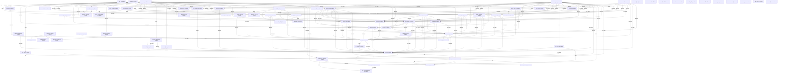
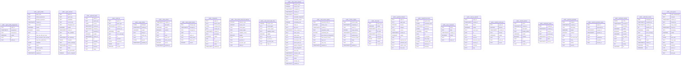

# Architecture Report

**agent-coordinator** — Multi-agent coordination MCP server

Generated: 2026-08-18T21:37:45+00:00  
Git SHA: `deefc16cfc7dc18497d18f3140e58d33d3fe64a3`

## System Overview

*Data sources: [architecture.graph.json](architecture.graph.json), [architecture.summary.json](architecture.summary.json), [python_analysis.json](python_analysis.json)*

This is a **Python MCP server** with 75 modules exposing **96 MCP endpoints** (83 tools, 11 resources, 2 prompts), backed by **27 Postgres tables**. The codebase contains 1066 functions (431 async) and 243 classes.

| Metric | Count |
|--------|-------|
| Total nodes | 1871 |
| Total edges | 1163 |
| Python modules | 75 |
| Functions | 1066 (431 async) |
| Classes | 243 |
| Mcp Endpoints | 96 |
| DB tables | 27 |
| Python nodes | 1436 |
| Sql nodes | 435 |

## Module Responsibility Map

*Data sources: [python_analysis.json](python_analysis.json), [architecture.graph.json](architecture.graph.json)*

| Module | Layer | Role | In / Out |
|--------|-------|------|----------|
| `agents_config` | Foundation | Load and validate ``agents.yaml``. | 11 / 4 |
| `approval` | Service | Parse a datetime value from various formats. | 14 / 2 |
| `assurance` | Service | — | 0 / 0 |
| `audit` | Foundation | Get the global audit service instance. | 46 / 6 |
| `audit_triage` | Service | Validate a single classifier finding against the required schema. | 2 / 1 |
| `axi_output` | Service | Detect truncation precisely via the limit+1 fetch pattern. | 11 / 0 |
| `cloudflare_access` | Service | Add the Cloudflare Access middleware to ``app`` when enabled. | 2 / 0 |
| `code_search` | Foundation | Return whether semantic code search is explicitly enabled. | 11 / 4 |
| `code_search_authorization` | Service | Intersect caller narrowing with a server-owned grant or reject safely. | 5 / 0 |
| `code_search_runtime` | Foundation | Read the default-off gate without importing optional search packages. | 22 / 3 |
| `config` | Foundation | Resolve COORDINATOR_WORKDIR_ROOT — repo root when unset. | 77 / 3 |
| `coordination_api` | Entry | Resolve effective API key by supported header precedence. | 1 / 216 |
| `coordination_cli` | Service | Bridge async service calls to synchronous CLI. | 0 / 41 |
| `coordination_mcp` | Entry | Own direct-search resources in the same loop that serves MCP calls. | 0 / 165 |
| `db` | Foundation | Factory: returns the appropriate DatabaseClient based on config. | 46 / 4 |
| `db_postgres` | Service | Coerce a PostgREST filter string value to the appropriate Python type. | 1 / 1 |
| `discovery` | Service | Get the global discovery service instance. | 16 / 8 |
| `docker_manager` | Service | Return ``True`` if the ``colima`` binary is on PATH. | 0 / 0 |
| `event_bus` | Foundation | Classify event urgency based on type. | 15 / 0 |
| `event_stream` | Service | Return COORDINATOR_SSE_SIGNING_KEY, or None if unset. | 8 / 4 |
| `feature_flags` | Service | Convert a change-id into a canonical flag name. | 1 / 0 |
| `feature_registry` | Foundation | Get the global feature registry service instance. | 24 / 8 |
| `git_adapter` | Service | Raise InvalidRefNameError if ref_name does not match SPECULATIVE_REF_PATTERN. | 2 / 0 |
| `github_classifier` | Service | Provides: _load_classifier | 1 / 0 |
| `github_coordination` | Service | Get the global GitHub coordination service instance. | 0 / 4 |
| `github_openspec_fetcher` | Service | Extract the first H1 heading from proposal.md text. | 2 / 0 |
| `github_prs_api` | Service | Parse GITHUB_REPOS env var.  Returns None on validation error. | 3 / 1 |
| `guardrails` | Foundation | Reset cached metric instruments (for testing). | 12 / 10 |
| `handoffs` | Foundation | Get the global handoff service instance. | 11 / 9 |
| `help_service` | Foundation | Return a compact overview of all capability groups. | 15 / 0 |
| `http_proxy` | Service | Validate URL against SSRF allowlist. | 58 / 4 |
| `issue_service` | Foundation | Get the global issue service instance. | 22 / 5 |
| `kanban_viz_files` | Service | Load a schema file by name (e.g. ``saved-view.json``). | 5 / 5 |
| `langfuse_middleware` | Service | Extract agent identity from the request API key. | 1 / 4 |
| `langfuse_tracing` | Service | Initialize the Langfuse client from configuration. | 7 / 2 |
| `locks` | Foundation | Lazy-init metric instruments. Returns None tuple when disabled. | 19 / 18 |
| `memory` | Foundation | Get the global memory service instance. | 11 / 8 |
| `merge_queue` | Foundation | Parse an ISO datetime string, returning None for empty/None. | 23 / 10 |
| `merge_train` | Foundation | Return the set of partition keys an entry belongs to. | 5 / 5 |
| `merge_train_service` | Service | Build a TrainEntry from a Feature's merge_queue metadata. | 13 / 11 |
| `merge_train_types` | Service | Return the set of lock-key namespaces a repo-relative path likely belongs to. | 5 / 0 |
| `merge_watcher` | Service | Provides: get_merge_watcher | 3 / 0 |
| `migrations` | Service | Return sorted list of (sequence_number, filename, path) for all migration files. | 5 / 2 |
| `model_routing` | Service | Pick a candidate, exploiting by default and exploring within budget. | 0 / 0 |
| `model_routing.exploration` | Service | Pick a candidate, exploiting by default and exploring within budget. | 0 / 0 |
| `model_routing.feedback` | Service | Reject non-finite or out-of-range feedback values before aggregation. | 0 / 0 |
| `model_routing.resolver` | Service | Blend benchmark prior with task-type posterior by sample-size confidence. | 0 / 0 |
| `network_policies` | Service | Get the global network policy service instance. | 2 / 4 |
| `notifications` | Service | Send an event notification. Returns True on success. | 3 / 6 |
| `notifications.base` | Service | Send an event notification. Returns True on success. | 0 / 0 |
| `notifications.gmail` | Service | Send an HTML email notification for the event. | 0 / 0 |
| `notifications.notifier` | Service | Register a notification channel. | 0 / 0 |
| `notifications.relay` | Service | Extract a notification token from an email subject line. | 0 / 0 |
| `notifications.telegram` | Service | Send an event notification as a Telegram message with Markdown formatting. | 0 / 0 |
| `notifications.templates` | Service | Escape a value for safe HTML embedding. | 0 / 0 |
| `notifications.webhook` | Service | POST JSON payload with event data to the webhook URL. | 0 / 0 |
| `openspec_proposals_api` | Service | Return the repo root. | 4 / 7 |
| `openspec_sources` | Service | Parse OPENSPEC_SOURCES env var value into SourceDescriptors. | 5 / 1 |
| `policy_engine` | Foundation | Get the global policy engine based on configuration. | 23 / 19 |
| `policy_sync` | Service | Return the singleton PolicySyncService instance. | 0 / 0 |
| `port_allocator` | Service | Return the global ``PortAllocatorService`` singleton. | 9 / 1 |
| `profile_loader` | Service | Recursively merge *override* into a copy of *base*. | 3 / 0 |
| `profiles` | Foundation | Get the global profiles service instance. | 12 / 7 |
| `refresh_rpc_client` | Foundation | Shell out to ``affected_tests.py`` and parse the returned test list. | 6 / 0 |
| `risk_scorer` | Service | Get the global risk scorer instance. | 0 / 2 |
| `session_grants` | Service | Parse a datetime value from various formats. | 5 / 3 |
| `sse_log_redaction` | Service | Install the redaction filter on the named logger (idempotent). | 3 / 0 |
| `status` | Service | Generate an 8-character URL-safe token. | 4 / 0 |
| `sync_points` | Service | Return ``(clear, active_list)`` by reading the worktree registry. | 1 / 1 |
| `teams` | Service | Get the global crew manifest (lazy singleton). | 2 / 3 |
| `telemetry` | Foundation | Initialize OpenTelemetry providers based on environment configuration. | 21 / 0 |
| `watchdog` | Service | Return the singleton WatchdogService. | 3 / 4 |
| `work_queue` | Foundation | Get the global work queue service instance. | 17 / 33 |
| `worktrees_view` | Service | Default: parents[2] of this file = repo root. | 2 / 2 |

**Layers**: Entry = exposes MCP endpoints; Service = domain logic; Foundation = imported by 3+ modules (config, db, audit).

## Dependency Layers

*Data source: [python_analysis.json](python_analysis.json)*

```
┌─────────────────────────────────────────────────┐
│  ENTRY       coordination_api, coordination_mcp  │
│             ↓ imports ↓                          │
│  SERVICE     approval, assurance, audit_triage, axi_output│
│              cloudflare_access, code_search_authorization, coordination_cli, db_postgres│
│              discovery, docker_manager, event_stream, feature_flags│
│              git_adapter, github_classifier, github_coordination, github_openspec_fetcher│
│              github_prs_api, http_proxy, kanban_viz_files, langfuse_middleware│
│              langfuse_tracing, merge_train_service, merge_train_types, merge_watcher│
│              migrations, model_routing, model_routing.exploration, model_routing.feedback│
│              model_routing.resolver, network_policies, notifications, notifications.base│
│              notifications.gmail, notifications.notifier, notifications.relay, notifications.telegram│
│              notifications.templates, notifications.webhook, openspec_proposals_api, openspec_sources│
│              policy_sync, port_allocator, profile_loader, risk_scorer│
│              session_grants, sse_log_redaction, status, sync_points│
│              teams, watchdog, worktrees_view     │
│             ↓ imports ↓                          │
│  FOUNDATION  agents_config, audit, code_search, code_search_runtime, config, db, event_bus, feature_registry, guardrails, handoffs, help_service, issue_service, locks, memory, merge_queue, merge_train, policy_engine, profiles, refresh_rpc_client, telemetry, work_queue│
└─────────────────────────────────────────────────┘
```

**Single points of failure** — changes to these modules ripple widely:

- `config` — imported by 23 modules
- `db` — imported by 21 modules
- `audit` — imported by 14 modules
- `policy_engine` — imported by 6 modules
- `telemetry` — imported by 6 modules
- `feature_registry` — imported by 5 modules
- `code_search` — imported by 4 modules
- `event_bus` — imported by 4 modules
- `guardrails` — imported by 4 modules
- `profiles` — imported by 4 modules
- `agents_config` — imported by 3 modules
- `code_search_runtime` — imported by 3 modules
- `handoffs` — imported by 3 modules
- `help_service` — imported by 3 modules
- `issue_service` — imported by 3 modules
- `locks` — imported by 3 modules
- `memory` — imported by 3 modules
- `merge_queue` — imported by 3 modules
- `merge_train` — imported by 3 modules
- `refresh_rpc_client` — imported by 3 modules
- `work_queue` — imported by 3 modules

## Entry Points

*Data sources: [architecture.graph.json](architecture.graph.json), [python_analysis.json](python_analysis.json)*

### Resources (11)

| Endpoint | Description |
|----------|-------------|
| `audit://recent` | Recent audit log entries. |
| `features://active` | Active features in the registry with their resource claims and priorities. |
| `gen-eval://coverage` | Gen-eval scenario coverage summary by category. |
| `gen-eval://report` | Latest gen-eval report summary. |
| `guardrails://patterns` | Active guardrail patterns for destructive operation detection. |
| `handoffs://recent` | Recent handoff documents from agent sessions. |
| `locks://current` | All currently active file locks. |
| `memories://recent` | Recent episodic memories across all agents. |
| `merge-queue://pending` | Features queued for merge with their status and priority. |
| `profiles://current` | Current agent's profile and permissions. |
| `work://pending` | Tasks waiting to be claimed from the work queue. |

### Prompts (2)

| Endpoint | Description |
|----------|-------------|
| `coordinate_file_edit` | Template for safely editing a file with coordination. |
| `start_work_session` | Template for starting a coordinated work session. |

### Other (83)

| Endpoint | Description |
|----------|-------------|
| `/agents/dispatch-configs` | Get CLI dispatch configs for agents with cli sections. |
| `/agents/{agent_id}/kick` | Clear a stale agent's worktree-registry entry and mark session disconnected. |
| `/approvals/pending` | List pending approval requests. |
| `/approvals/request` | Submit a human-in-the-loop approval request. |
| `/approvals/{request_id}` | Check the status of an approval request. |
| `/approvals/{request_id}/decide` | Approve or deny an approval request. |
| `/archetypes/resolve_for_phase` | Resolve archetype + model + system_prompt for an autopilot phase. |
| `/audit` | Query audit trail entries. |
| `/discovery/agents` | Discover agents with optional capability/status filters. |
| `/discovery/cleanup` | Clean up stale agent sessions and release their locks. |
| `/discovery/heartbeat` | Send a heartbeat for an agent session. |
| `/discovery/register` | Register an agent session for discovery. |
| `/events/auth` | Mint a short-lived JWT for the SSE auth handshake. |
| `/events/work` | SSE stream of work-queue transitions and audit events. |
| `/features/active` | List all active features ordered by merge priority. |
| `/features/conflicts` | Analyze resource conflicts between a candidate and active features. |
| `/features/deregister` | Deregister a feature (mark completed/cancelled). |
| `/features/register` | Register a feature with resource claims. |
| `/features/{feature_id}` | Get details of a specific feature. |
| `/gen-eval/create` | Generate a scaffold scenario YAML from a description. |
| `/gen-eval/run` | Run gen-eval testing against the coordinator's interfaces. |
| `/gen-eval/scenarios` | List gen-eval scenarios, optionally filtered by category or interface. |
| `/gen-eval/validate` | Validate a gen-eval scenario YAML document. |
| `/github/prs` | List open pull requests across configured repos. |
| `/guardrails/check` | Check an operation for destructive patterns. |
| `/handoffs/read` | Read previous handoff documents for session continuity. |
| `/handoffs/write` | Write a handoff document for session continuity. |
| `/health` | Human-facing health summary without affecting platform liveness. |
| `/help` | Compact overview of all coordinator capabilities. |
| `/help/{topic}` | Detailed help for a specific capability group. |
| `/issues/blocked` | List issues blocked by unresolved dependencies. Read-only, no auth. |
| `/issues/close` | Close one or more issues. |
| `/issues/comment` | Add a comment to an issue. |
| `/issues/create` | Create a new issue. |
| `/issues/list` | List issues with optional filters. |
| `/issues/ready` | List issues with no unresolved dependencies (ready to work on). |
| `/issues/search` | Search issues by text matching in title and description. |
| `/issues/update` | Update an issue. |
| `/issues/{issue_id}` | Get full issue details. |
| `/issues/{issue_id}/labels` | Add or remove labels on a work_queue row (drag-to-Ready interaction). |
| `/kanban-viz/audit` | Append a UI audit event (coordinator-owned, design D10). |
| `/kanban-viz/saved-views/{slug}` | Write a saved-view JSON file (coordinator-owned, design D10). |
| `/live` | Cheap liveness probe for container platforms. |
| `/locks/acquire` | Acquire a file lock. Cloud agents call this before modifying files. |
| `/locks/release` | Release a file lock. |
| `/locks/status/{path:path}` | Check lock status for a file. Read-only, no API key required. |
| `/locks/{path:path}` | Force-release a lock regardless of holder (destructive-write). |
| `/memory/query` | Query relevant memories for a task. |
| `/memory/store` | Store an episodic memory. |
| `/merge-queue` | Get all features in the merge queue. |
| `/merge-queue/check/{feature_id}` | Run pre-merge validation checks on a feature. |
| `/merge-queue/enqueue` | Add a feature to the merge queue. |
| `/merge-queue/merged/{feature_id}` | Mark a feature as merged and deregister it. |
| `/merge-queue/next` | Get the highest-priority feature ready to merge. |
| `/merge-queue/{feature_id}` | Remove a feature from the merge queue without merging. |
| `/merge-train/affected-tests` | Compute the test subset for a given set of changed files (R9). |
| `/merge-train/compose` | Compose a new speculative merge train from the current queue. |
| `/merge-train/eject` | Eject a feature from its current merge train. |
| `/merge-train/metrics` | Return aggregated merge throughput metrics from the audit log. |
| `/merge-train/report-result` | Record the result of speculative CI verification. |
| `/merge-train/status/{train_id}` | Return every entry currently belonging to ``train_id``. |
| `/notifications/status` | Get event bus and notification system status. |
| `/notifications/test` | Send a test notification through the event bus. |
| `/openspec/proposals` | List OpenSpec proposals (non-archive) with implementation state. |
| `/permissions/request` | Request a session-scoped permission grant. |
| `/policies/{policy_name}/rollback` | Rollback a Cedar policy to a previous version. |
| `/policies/{policy_name}/versions` | List version history for a Cedar policy. |
| `/policy/check` | Check if an operation is authorized by the policy engine. |
| `/policy/validate` | Validate Cedar policy text against the schema. |
| `/ports/allocate` | Allocate a block of ports for a session. |
| `/ports/release` | Release a port allocation for a session. |
| `/ports/status` | List all active port allocations. Read-only, no API key required. |
| `/profiles/me` | Get the calling agent's profile. |
| `/ready` | Readiness probe that verifies required dependencies. |
| `/search/code` |  |
| `/search/code/status` |  |
| `/status/report` | Accept status reports from agent hooks (Stop/SubagentStop). |
| `/sync-points/status` | Return the blocker state of the three sync-point skills. |
| `/work/claim` | Claim a task from the work queue. |
| `/work/complete` | Mark a task as completed. |
| `/work/get` | Get a specific task by ID. |
| `/work/submit` | Submit new work to the queue. |
| `/worktrees/active` | Return active worktree entries from .git-worktrees/.registry.json. |

## Architecture Health

*Data source: [architecture.diagnostics.json](architecture.diagnostics.json)*

**2690 findings** across 4 categories:

### Orphan — 1189

1189 symbols are unreachable from any entrypoint — may be dead code or missing wiring.

- '__init__' is unreachable from any entrypoint or test
- 'agents_config' is unreachable from any entrypoint or test
- 'PollConfig' is unreachable from any entrypoint or test
- 'ModeConfig' is unreachable from any entrypoint or test
- 'CliConfig' is unreachable from any entrypoint or test
- ... and 1184 more

### Reachability — 96

96 entrypoints have downstream dependencies but no DB writes or side effects.

Breakdown: 88 info, 8 warning.

- Entrypoint 'acquire_lock' has downstream dependencies but none touch a DB or produce side effects
- Entrypoint 'release_lock' has downstream dependencies but none touch a DB or produce side effects
- Entrypoint 'check_lock_status' has downstream dependencies but none touch a DB or produce side effects
- Entrypoint 'store_memory' has downstream dependencies but none touch a DB or produce side effects
- Entrypoint 'query_memories' has downstream dependencies but none touch a DB or produce side effects
- ... and 91 more

### Test Coverage — 1309

1309 functions lack test references — consider adding tests for critical paths.

- Function 'PollConfig' has no corresponding test references
- Function 'ModeConfig' has no corresponding test references
- Function 'CliConfig' has no corresponding test references
- Function 'SdkConfig' has no corresponding test references
- Function 'AgentEntry' has no corresponding test references
- ... and 1304 more

### Disconnected Flow (expected) — 96

96 MCP routes have no frontend callers — expected (clients are AI agents).

- Backend route 'acquire_lock' has no frontend callers
- Backend route 'release_lock' has no frontend callers
- Backend route 'check_lock_status' has no frontend callers
- Backend route 'store_memory' has no frontend callers
- Backend route 'query_memories' has no frontend callers
- ... and 91 more

## High-Impact Nodes

*Data sources: [high_impact_nodes.json](high_impact_nodes.json), [parallel_zones.json](parallel_zones.json)*

107 nodes with >= 5 transitive dependents. Changes to these ripple through the codebase — test thoroughly.

| Node | Dependents | Risk |
|------|------------|------|
| `config.get_config` | 181 | Critical — affects 181 downstream functions (28 modules affected) |
| `http_proxy._error_response` | 109 | Critical — affects 109 downstream functions (modules: coordination_mcp, http_proxy) |
| `http_proxy.get_client` | 109 | Critical — affects 109 downstream functions (modules: coordination_mcp, http_proxy) |
| `http_proxy._request` | 108 | Critical — affects 108 downstream functions (modules: coordination_mcp, http_proxy) |
| `http_proxy._agent_identity` | 72 | Critical — affects 72 downstream functions (modules: coordination_mcp, http_proxy) |
| `policy_engine.get_policy_engine` | 43 | Critical — affects 43 downstream functions (6 modules affected) |
| `audit.get_audit_service` | 32 | Critical — affects 32 downstream functions (13 modules affected) |
| `config` | 31 | Critical — affects 31 downstream functions (31 modules affected) |
| `coordination_api.resolve_identity` | 31 | Critical — affects 31 downstream functions (modules: coordination_api) |
| `coordination_cli._print_dict` | 28 | Critical — affects 28 downstream functions (modules: coordination_cli) |
| `coordination_api.authorize_operation` | 27 | Critical — affects 27 downstream functions (modules: coordination_api) |
| `coordination_cli._output` | 27 | Critical — affects 27 downstream functions (modules: coordination_cli) |
| `db.create_db_client` | 26 | Critical — affects 26 downstream functions (23 modules affected) |
| `coordination_cli._run` | 25 | Critical — affects 25 downstream functions (modules: coordination_cli) |
| `db.get_db` | 25 | Critical — affects 25 downstream functions (22 modules affected) |
| `db_postgres` | 25 | Critical — affects 25 downstream functions (25 modules affected) |
| `db` | 24 | Critical — affects 24 downstream functions (24 modules affected) |
| `code_search_authorization._is_normalized_relative` | 21 | Critical — affects 21 downstream functions (modules: code_search, code_search_authorization) |
| `code_search_authorization.validate_safe_glob` | 20 | Critical — affects 20 downstream functions (modules: code_search, code_search_authorization) |
| `merge_queue.get_merge_queue_service` | 20 | Critical — affects 20 downstream functions (modules: coordination_api, coordination_cli, coordination_mcp) |
| `feature_registry.get_feature_registry_service` | 19 | High — test `feature_registry` changes thoroughly (5 modules affected) |
| `issue_service.get_issue_service` | 19 | High — test `issue_service` changes thoroughly (modules: coordination_api, coordination_mcp) |
| `profile_loader.interpolate` | 18 | High — test `profile_loader` changes thoroughly (7 modules affected) |
| `profile_loader._load_secrets_file` | 17 | High — test `profile_loader` changes thoroughly (7 modules affected) |
| `teams.CrewManifest.validate` | 17 | High — test `teams` changes thoroughly (6 modules affected) |
| `audit` | 16 | High — test `audit` changes thoroughly (15 modules affected) |
| `audit_triage` | 16 | High — test `audit_triage` changes thoroughly (15 modules affected) |
| `openspec_proposals_api._run_git` | 14 | High — test `openspec_proposals_api` changes thoroughly (modules: coordination_api, openspec_proposals_api, openspec_sources) |
| `work_queue.get_work_queue_service` | 14 | High — test `work_queue` changes thoroughly (modules: coordination_api, coordination_cli, coordination_mcp) |
| `agents_config._default_agents_path` | 13 | High — test `agents_config` changes thoroughly (6 modules affected) |
| ... | | 77 more |

## Code Health Indicators

*Data source: [python_analysis.json](python_analysis.json)*

### Quick Stats

| Indicator | Value |
|-----------|-------|
| Async ratio | 431/1066 (40%) |
| Docstring coverage | 759/1066 (71%) |
| Dead code candidates | 500 |

### Hot Functions

Functions called by the most other functions — changes here have wide blast radius:

| Function | Callers |
|----------|---------|
| `http_proxy._request` | 54 |
| `config.get_config` | 50 |
| `http_proxy.get_config` | 50 |
| `http_proxy._agent_identity` | 36 |
| `audit.get_audit_service` | 32 |
| `coordination_api.resolve_identity` | 31 |
| `coordination_api.authorize_operation` | 27 |
| `coordination_cli._run` | 25 |
| `db.get_db` | 25 |
| `git_adapter.SubprocessGitAdapter._run` | 25 |

### Dead Code Candidates

500 functions are unreachable from entrypoints via static analysis. Some may be used dynamically (e.g., classmethods, test helpers).

- **agents_config** (9): `get_mcp_env`, `reset_agents_config`, `get_agent_isolation`, `get_phase_mapping`, `reset_archetypes_config`, `resolve_provider_model`, ... (+3)
- **approval** (8): `db`, `submit_request`, `check_request`, `decide_request`, `expire_stale_requests`, `list_pending`, ... (+2)
- **audit** (6): `from_dict`, `db`, `log_operation`, `_insert_audit_entry`, `query`, `timed`
- **audit_triage** (5): `push`, `drain_all`, `load_prompt`, `drain_and_classify`, `reset_triage_buffer`
- **cloudflare_access** (4): `_signing_key`, `verify`, `_is_exempt`, `_deny`
- **code_search** (14): `validate_main_key`, `validate_patterns`, `validate_reference`, `validate_languages`, `validate_paths`, `require_non_main_index`, ... (+8)
- **code_search_authorization** (4): `allow_path_regexes`, `deny_path_regexes`, `path_regexes`, `allows`
- **code_search_runtime** (18): `validate_truth_table`, `clear`, `embed_one`, `state_counts`, `status_snapshot`, `status`, ... (+12)
- **config** (5): `is_enabled`, `create_client`, `from_env`, `from_env`, `reset_config`
- **coordination_api** (7): `optional_api_key`, `create_coordination_api`, `lifespan`, `code_search_problem_handler`, `request_validation_handler`, `verify_code_search_principal`, ... (+1)
- **coordination_cli** (27): `cmd_health`, `cmd_feature_register`, `cmd_feature_deregister`, `cmd_feature_show`, `cmd_feature_list`, `cmd_feature_conflicts`, ... (+21)
- **coordination_mcp** (63): `_mcp_lifespan`, `acquire_lock`, `release_lock`, `check_locks`, `get_work`, `complete_work`, ... (+57)
- **db** (17): `rpc`, `query`, `insert`, `update`, `delete`, `close`, ... (+11)
- **db_postgres** (7): `_get_pool`, `rpc`, `query`, `insert`, `update`, `delete`, ... (+1)
- **discovery** (5): `db`, `register`, `discover`, `heartbeat`, `cleanup_dead_agents`
- **docker_manager** (2): `start_container`, `wait_for_healthy`
- **event_bus** (14): `to_json`, `running`, `failed`, `on_event`, `off_event`, `start`, ... (+8)
- **event_stream** (3): `mint_events_token`, `_on_task_event`, `_on_audit_event`
- **feature_flags** (15): `is_enabled`, `to_yaml_dict`, `load`, `_load_unlocked`, `_get_registry`, `resolve_flag`, ... (+9)
- **feature_registry** (6): `db`, `register`, `deregister`, `get_feature`, `get_active_features`, `analyze_conflicts`
- **git_adapter** (11): `create_speculative_ref`, `delete_speculative_refs`, `fast_forward_main`, `get_changed_files`, `list_speculative_refs`, `_ensure_git_version`, ... (+5)
- **github_classifier** (1): `_load_classifier`
- **github_coordination** (9): `from_dict`, `db`, `parse_lock_labels`, `parse_branch`, `sync_label_locks`, `sync_branch_tracking`, ... (+3)
- **guardrails** (5): `reset_guardrail_instruments`, `from_dict`, `db`, `_load_patterns`, `check_operation`
- **handoffs** (4): `db`, `write`, `read`, `get_recent`
- **help_service** (1): `_register`
- **issue_service** (10): `db`, `create`, `list_issues`, `show`, `update`, `close`, ... (+4)
- **kanban_viz_files** (1): `_load_schema`
- **langfuse_middleware** (1): `dispatch`
- **langfuse_tracing** (4): `create_span`, `end_span`, `trace_operation`, `reset_langfuse`
- **locks** (8): `is_valid_lock_key`, `db`, `acquire`, `release`, `check`, `extend`, ... (+2)
- **memory** (3): `db`, `remember`, `recall`
- **merge_queue** (8): `db`, `registry`, `enqueue`, `get_queue`, `get_next_to_merge`, `run_pre_merge_checks`, ... (+2)
- **merge_train** (6): `validate_post_speculation_claims`, `reset_blocked_entry`, `reset_abandoned_entry`, `execute_wave_merge`, `cleanup_orphaned_speculative_refs`, `gc_aged_speculative_refs`
- **merge_train_service** (20): `db`, `registry`, `git_adapter`, `refresh_client`, `_load_entries`, `_save_entry`, ... (+14)
- **merge_train_types** (5): `is_terminal`, `to_metadata_dict`, `all_passed`, `all_entries`, `total_entry_count`
- **merge_watcher** (4): `start`, `stop`, `_loop`, `_tick`
- **model_routing** (6): `exhausted`, `choose`, `aggregate`, `normalize_vendor_switch`, `normalize_vendor_notes`, `score_and_rank`
- **network_policies** (2): `db`, `check_domain`
- **notifications** (38): `send`, `test`, `supports_reply`, `send`, `test`, `supports_reply`, ... (+32)
- **openspec_sources** (1): `warm_local_sources`
- **policy_engine** (25): `db`, `check_operation`, `_do_check_operation`, `check_network_access`, `list_policy_versions`, `rollback_policy`, ... (+19)
- **policy_sync** (13): `start`, `stop`, `on_policy_change`, `running`, `on_policy_change`, `start`, ... (+7)
- **port_allocator** (6): `env_snippet`, `allocate`, `release`, `status`, `_cleanup_expired`, `reset_port_allocator`
- **profile_loader** (2): `resolve_dynamic_dsn`, `_replace`
- **profiles** (5): `from_dict`, `db`, `get_profile`, `check_operation`, `_log_denial`
- **refresh_rpc_client** (4): `is_graph_stale`, `trigger_refresh`, `get_refresh_status`, `_invoke`
- **risk_scorer** (10): `db`, `compute_score`, `get_violation_count`, `_trust_factor`, `_operation_factor`, `_resource_factor`, ... (+4)
- **session_grants** (7): `db`, `request_grant`, `get_active_grants`, `has_grant`, `revoke_grants`, `_row_to_grant`, ... (+1)
- **sse_log_redaction** (3): `filter`, `_scrub`, `redact_token`
- **status** (1): `cleanup_expired_tokens`
- **sync_points** (1): `get_sync_points_status`
- **teams** (8): `can_claim`, `from_dict`, `get_role`, `vendors_for`, `validate_against`, `_claimability_errors`, ... (+2)
- **telemetry** (4): `set_attribute`, `set_status`, `record_exception`, `reset_telemetry`
- **watchdog** (14): `db`, `running`, `start`, `stop`, `run_once`, `_loop`, ... (+8)
- **work_queue** (10): `db`, `_resolve_trust_level`, `claim`, `complete`, `submit`, `get_pending`, ... (+4)

## Parallel Modification Zones

*Data source: [parallel_zones.json](parallel_zones.json)*

**1177 independent groups** identified. The largest interconnected group has 529 modules; 1481 modules are leaf nodes (safe to modify in isolation).

**38 high-impact modules** act as coupling points — parallel changes touching these need coordination.

### Interconnected Groups

**Group 0** (529 members spanning 54 modules): `agents_config`, `approval`, `audit`, `audit_triage`, `axi_output`, `cloudflare_access`, `code_search`, `code_search_runtime`
  ... and 46 more modules

**Group 1** (54 members spanning 54 modules): `agents_config`, `approval`, `audit`, `audit_triage`, `axi_output`, `cloudflare_access`, `code_search`, `code_search_authorization`
  ... and 46 more modules

**Group 2** (35 members spanning 2 modules): `code_search`, `code_search_authorization`

**Group 3** (18 members spanning 3 modules): `merge_train`, `merge_train_service`, `merge_train_types`

**Group 4** (14 members spanning 1 modules): `notifications`

**Group 5** (9 members spanning 1 modules): `code_search_runtime`

**Group 6** (9 members spanning 1 modules): `db_postgres`

**Group 7** (6 members spanning 1 modules): `docker_manager`

**Group 8** (6 members spanning 1 modules): `git_adapter`

**Group 9** (6 members spanning 1 modules): `model_routing`

### Leaf Modules (1481)

1481 modules have no dependents — changes are fully isolated. 1155 of the 1177 groups are singletons.

## Architecture Diagrams

*Data source: [architecture.graph.json](architecture.graph.json)*

### Container View


```mermaid
flowchart TB
    Backend["Backend (1436 nodes)"]
    Database["Database (435 nodes)"]
```

### Backend Components


```mermaid
flowchart TB
    __init__["__init__ (1 symbols)"]
    agents_config["agents_config (41 symbols)"]
    approval["approval (14 symbols)"]
    assurance["assurance (1 symbols)"]
    audit["audit (17 symbols)"]
    audit_triage["audit_triage (11 symbols)"]
    axi_output["axi_output (4 symbols)"]
    cloudflare_access["cloudflare_access (12 symbols)"]
    code_search["code_search (37 symbols)"]
    code_search_authorization["code_search_authorization (40 symbols)"]
    code_search_runtime["code_search_runtime (45 symbols)"]
    config["config (45 symbols)"]
    coordination_api["coordination_api (148 symbols)"]
    coordination_cli["coordination_cli (34 symbols)"]
    coordination_mcp["coordination_mcp (80 symbols)"]
    db["db (23 symbols)"]
    db_postgres["db_postgres (14 symbols)"]
    discovery["discovery (20 symbols)"]
    docker_manager["docker_manager (8 symbols)"]
    event_bus["event_bus (22 symbols)"]
    event_stream["event_stream (13 symbols)"]
    feature_flags["feature_flags (26 symbols)"]
    feature_registry["feature_registry (19 symbols)"]
    git_adapter["git_adapter (25 symbols)"]
    github_classifier["github_classifier (2 symbols)"]
    github_coordination["github_coordination (16 symbols)"]
    github_openspec_fetcher["github_openspec_fetcher (10 symbols)"]
    github_prs_api["github_prs_api (8 symbols)"]
    guardrails["guardrails (16 symbols)"]
    handoffs["handoffs (14 symbols)"]
    help_service["help_service (6 symbols)"]
    http_proxy["http_proxy (69 symbols)"]
    issue_service["issue_service (21 symbols)"]
    kanban_viz_files["kanban_viz_files (10 symbols)"]
    langfuse_middleware["langfuse_middleware (5 symbols)"]
    langfuse_tracing["langfuse_tracing (10 symbols)"]
    locks["locks (19 symbols)"]
    memory["memory (13 symbols)"]
    merge_queue["merge_queue (17 symbols)"]
    merge_train["merge_train (30 symbols)"]
    merge_train_service["merge_train_service (29 symbols)"]
    merge_train_types["merge_train_types (14 symbols)"]
    merge_watcher["merge_watcher (8 symbols)"]
    migrations["migrations (5 symbols)"]
    model_routing____init__["model_routing.__init__ (1 symbols)"]
    model_routing__exploration["model_routing.exploration (5 symbols)"]
    model_routing__feedback["model_routing.feedback (8 symbols)"]
    model_routing__resolver["model_routing.resolver (11 symbols)"]
    network_policies["network_policies (8 symbols)"]
    notifications____init__["notifications.__init__ (1 symbols)"]
    notifications__base["notifications.base (10 symbols)"]
    notifications__gmail["notifications.gmail (13 symbols)"]
    notifications__notifier["notifications.notifier (14 symbols)"]
    notifications__relay["notifications.relay (6 symbols)"]
    notifications__telegram["notifications.telegram (11 symbols)"]
    notifications__templates["notifications.templates (11 symbols)"]
    notifications__webhook["notifications.webhook (8 symbols)"]
    openspec_proposals_api["openspec_proposals_api (16 symbols)"]
    openspec_sources["openspec_sources (10 symbols)"]
    policy_engine["policy_engine (36 symbols)"]
    policy_sync["policy_sync (17 symbols)"]
    port_allocator["port_allocator (12 symbols)"]
    profile_loader["profile_loader (14 symbols)"]
    profiles["profiles (14 symbols)"]
    refresh_rpc_client["refresh_rpc_client (12 symbols)"]
    risk_scorer["risk_scorer (14 symbols)"]
    session_grants["session_grants (13 symbols)"]
    sse_log_redaction["sse_log_redaction (6 symbols)"]
    status["status (6 symbols)"]
    sync_points["sync_points (5 symbols)"]
    teams["teams (14 symbols)"]
    telemetry["telemetry (20 symbols)"]
    tests__test_architecture["tests.test_architecture (52 symbols)"]
    watchdog["watchdog (18 symbols)"]
    work_queue["work_queue (24 symbols)"]
    worktrees_view["worktrees_view (4 symbols)"]
    agents_config -->|"call"| profile_loader
    agents_config -->|"call"| teams
    approval -->|"call, import"| db
    audit -->|"call, import"| audit_triage
    audit -->|"call, import"| config
    audit -->|"call, import"| db
    audit_triage -->|"import"| audit
    code_search -->|"call, import"| code_search_authorization
    code_search_runtime -->|"call, import"| code_search
    code_search_runtime -->|"import"| code_search_authorization
    config -->|"call"| agents_config
    config -->|"call"| code_search_runtime
    config -->|"call"| profile_loader
    coordination_api -->|"call, import"| agents_config
    coordination_api -->|"call, import"| approval
    coordination_api -->|"call, import"| audit
    coordination_api -->|"call, import"| axi_output
    coordination_api -->|"call, import"| cloudflare_access
    coordination_api -->|"call, import"| code_search
    coordination_api -->|"call, import"| code_search_runtime
    coordination_api -->|"call, import"| config
    coordination_api -->|"call, import"| db
    coordination_api -->|"call, import"| discovery
    coordination_api -->|"call, import"| event_bus
    coordination_api -->|"call, import"| event_stream
    coordination_api -->|"call, import"| feature_registry
    coordination_api -->|"call, import"| github_prs_api
    coordination_api -->|"call, import"| guardrails
    coordination_api -->|"call, import"| handoffs
    coordination_api -->|"call, import"| help_service
    coordination_api -->|"call, import"| issue_service
    coordination_api -->|"call, import"| kanban_viz_files
    coordination_api -->|"import"| langfuse_middleware
    coordination_api -->|"call, import"| langfuse_tracing
    coordination_api -->|"call, import"| locks
    coordination_api -->|"call, import"| memory
    coordination_api -->|"call, import"| merge_queue
    coordination_api -->|"import"| merge_train
    coordination_api -->|"call, import"| merge_train_service
    coordination_api -->|"call, import"| merge_watcher
    coordination_api -->|"call, import"| migrations
    coordination_api -->|"call, import"| notifications__notifier
    coordination_api -->|"call, import"| openspec_proposals_api
    coordination_api -->|"call, import"| policy_engine
    coordination_api -->|"call, import"| port_allocator
    coordination_api -->|"call, import"| profiles
    coordination_api -->|"call, import"| refresh_rpc_client
    coordination_api -->|"call, import"| session_grants
    coordination_api -->|"call, import"| sse_log_redaction
    coordination_api -->|"import"| sync_points
    coordination_api -->|"call, import"| telemetry
    coordination_api -->|"call, import"| watchdog
    coordination_api -->|"call, import"| work_queue
    coordination_api -->|"import"| worktrees_view
    coordination_cli -->|"call, import"| audit
    coordination_cli -->|"import"| axi_output
    coordination_cli -->|"call, import"| config
    coordination_cli -->|"call, import"| db
    coordination_cli -->|"call, import"| feature_registry
    coordination_cli -->|"call, import"| guardrails
    coordination_cli -->|"call, import"| handoffs
    coordination_cli -->|"call, import"| help_service
    coordination_cli -->|"call, import"| locks
    coordination_cli -->|"call, import"| memory
    coordination_cli -->|"call, import"| merge_queue
    coordination_cli -->|"call, import"| work_queue
    coordination_mcp -->|"call, import"| agents_config
    coordination_mcp -->|"call, import"| approval
    coordination_mcp -->|"call, import"| audit
    coordination_mcp -->|"import"| code_search
    coordination_mcp -->|"call, import"| code_search_runtime
    coordination_mcp -->|"call, import"| config
    coordination_mcp -->|"call, import"| discovery
    coordination_mcp -->|"call, import"| event_bus
    coordination_mcp -->|"call, import"| feature_registry
    coordination_mcp -->|"call, import"| guardrails
    coordination_mcp -->|"call, import"| handoffs
    coordination_mcp -->|"call, import"| help_service
    coordination_mcp -->|"call"| http_proxy
    coordination_mcp -->|"call, import"| issue_service
    coordination_mcp -->|"call, import"| locks
    coordination_mcp -->|"call, import"| memory
    coordination_mcp -->|"call, import"| merge_queue
    coordination_mcp -->|"import"| merge_train
    coordination_mcp -->|"call, import"| merge_train_service
    coordination_mcp -->|"call, import"| migrations
    coordination_mcp -->|"call, import"| policy_engine
    coordination_mcp -->|"call, import"| port_allocator
    coordination_mcp -->|"call, import"| profiles
    coordination_mcp -->|"call, import"| refresh_rpc_client
    coordination_mcp -->|"call, import"| session_grants
    coordination_mcp -->|"call, import"| telemetry
    coordination_mcp -->|"call, import"| work_queue
    db -->|"call, import"| config
    db -->|"import"| db_postgres
    db_postgres -->|"import"| config
    discovery -->|"call, import"| audit
    discovery -->|"call, import"| config
    discovery -->|"call, import"| db
    event_stream -->|"call"| coordination_api
    event_stream -->|"import"| event_bus
    event_stream -->|"import"| issue_service
    event_stream -->|"import"| worktrees_view
    feature_registry -->|"call, import"| audit
    feature_registry -->|"call, import"| config
    feature_registry -->|"call, import"| db
    feature_registry -->|"call"| discovery
    github_coordination -->|"call, import"| config
    github_coordination -->|"call, import"| db
    github_prs_api -->|"import"| github_classifier
    guardrails -->|"call, import"| audit
    guardrails -->|"call, import"| config
    guardrails -->|"call, import"| db
    guardrails -->|"call, import"| telemetry
    handoffs -->|"call, import"| audit
    handoffs -->|"call, import"| config
    handoffs -->|"call, import"| db
    handoffs -->|"call, import"| policy_engine
    http_proxy -->|"import"| code_search
    http_proxy -->|"call, import"| code_search_runtime
    http_proxy -->|"call"| config
    issue_service -->|"call, import"| config
    issue_service -->|"call, import"| db
    issue_service -->|"call"| discovery
    kanban_viz_files -->|"call, import"| config
    langfuse_middleware -->|"call, import"| config
    langfuse_middleware -->|"call, import"| langfuse_tracing
    langfuse_tracing -->|"call, import"| config
    locks -->|"call"| approval
    locks -->|"call, import"| audit
    locks -->|"call, import"| config
    locks -->|"call, import"| db
    locks -->|"call, import"| policy_engine
    locks -->|"call, import"| telemetry
    memory -->|"call, import"| audit
    memory -->|"call, import"| config
    memory -->|"call, import"| db
    memory -->|"call, import"| policy_engine
    merge_queue -->|"call"| approval
    merge_queue -->|"call, import"| audit
    merge_queue -->|"call, import"| db
    merge_queue -->|"call"| feature_flags
    merge_queue -->|"call, import"| feature_registry
    merge_train -->|"import"| git_adapter
    merge_train -->|"call, import"| merge_train_types
    merge_train_service -->|"call"| approval
    merge_train_service -->|"call, import"| db
    merge_train_service -->|"call, import"| feature_registry
    merge_train_service -->|"import"| git_adapter
    merge_train_service -->|"call, import"| merge_train
    merge_train_service -->|"import"| merge_train_types
    merge_train_service -->|"import"| refresh_rpc_client
    migrations -->|"call, import"| config
    network_policies -->|"call, import"| config
    network_policies -->|"call, import"| db
    notifications__gmail -->|"call"| db
    notifications__gmail -->|"call"| notifications__relay
    notifications__gmail -->|"call"| notifications__templates
    notifications__gmail -->|"call"| status
    notifications__notifier -->|"call"| notifications__templates
    openspec_proposals_api -->|"call"| github_openspec_fetcher
    openspec_proposals_api -->|"call"| openspec_sources
    openspec_sources -->|"call"| openspec_proposals_api
    policy_engine -->|"call, import"| audit
    policy_engine -->|"call, import"| config
    policy_engine -->|"call, import"| db
    policy_engine -->|"call, import"| network_policies
    policy_engine -->|"call, import"| profiles
    policy_engine -->|"call, import"| telemetry
    port_allocator -->|"import"| config
    profiles -->|"call, import"| audit
    profiles -->|"call, import"| config
    profiles -->|"call, import"| db
    risk_scorer -->|"call, import"| db
    session_grants -->|"call"| approval
    session_grants -->|"call, import"| db
    sync_points -->|"call"| code_search_runtime
    teams -->|"call"| agents_config
    watchdog -->|"call, import"| db
    watchdog -->|"call, import"| event_bus
    work_queue -->|"call, import"| agents_config
    work_queue -->|"call, import"| audit
    work_queue -->|"call, import"| config
    work_queue -->|"call, import"| db
    work_queue -->|"call"| discovery
    work_queue -->|"call, import"| guardrails
    work_queue -->|"call"| locks
    work_queue -->|"call, import"| policy_engine
    work_queue -->|"call, import"| profiles
    work_queue -->|"call, import"| telemetry
    worktrees_view -->|"call"| approval
    worktrees_view -->|"call"| code_search_runtime
```

### Frontend Components


```mermaid
flowchart TB
    empty["No TypeScript nodes found"]
```

### Database ERD


```mermaid
erDiagram
    public__agent_profile_assignments {
        TEXT agent_id
        TIMESTAMPTZ assigned_at
        TEXT assigned_by
        UNKNOWN enable
        UUID id
        UUID profile_id
    }
    public__agent_profiles {
        TEXT agent_type
        TEXT allowed_operations
        TEXT blocked_operations
        TIMESTAMPTZ created_at
        TEXT description
        UNKNOWN enable
        BOOLEAN enabled
        UUID id
        INT max_api_calls_per_hour
        INT max_execution_time_seconds
        INT max_file_modifications
        JSONB metadata
        TEXT name
        JSONB network_policy
        INT trust_level
        TIMESTAMPTZ updated_at
    }
    public__agent_sessions {
        TEXT agent_id
        TEXT agent_type
        TEXT capabilities
        TEXT current_task
        TEXT delegated_from
        UNKNOWN enable
        TIMESTAMPTZ ended_at
        TEXT files_modified
        TEXT id
        TIMESTAMPTZ last_heartbeat
        JSONB metadata
        TEXT phase_archetype
        TIMESTAMPTZ started_at
        TEXT status
        TEXT task_description
        INTEGER tasks_completed
    }
    public__approval_queue {
        TEXT agent_id
        TEXT agent_type
        JSONB context
        TIMESTAMPTZ created_at
        TIMESTAMPTZ decided_at
        TEXT decided_by
        UNKNOWN enable
        TIMESTAMPTZ expires_at
        UUID id
        TEXT operation
        TEXT reason
        TEXT resource
        TEXT status
    }
    public__audit_log {
        TEXT agent_id
        TEXT agent_type
        TIMESTAMPTZ created_at
        INT duration_ms
        UNKNOWN enable
        TEXT error_message
        UUID id
        TEXT operation
        JSONB parameters
        JSONB result
        BOOLEAN success
    }
    public__cedar_entities {
        JSONB attributes
        TIMESTAMPTZ created_at
        UNKNOWN enable
        TEXT entity_id
        TEXT entity_type
        UUID id
        JSONB parents
        TIMESTAMPTZ updated_at
    }
    public__cedar_policies {
        TIMESTAMPTZ created_at
        TEXT description
        UNKNOWN enable
        BOOLEAN enabled
        UUID id
        TEXT name
        TEXT policy_text
        INTEGER policy_version
        INTEGER priority
        TIMESTAMPTZ updated_at
    }
    public__cedar_policies_history {
        TEXT change_type
        TIMESTAMPTZ changed_at
        TEXT changed_by
        UUID id
        UUID policy_id
        TEXT policy_name
        TEXT policy_text
        INTEGER version
    }
    public__changesets {
        TEXT agent_id
        TEXT branch_name
        JSONB changed_files
        TEXT commit_sha
        TIMESTAMPTZ created_at
        TEXT description
        UNKNOWN enable
        UUID id
        TEXT session_id
        TEXT status
        TIMESTAMPTZ updated_at
    }
    public__code_search_index_file_attempts {
        INTEGER attempt_count
        INTEGER chunk_count
        TEXT chunk_digest
        TEXT content_digest
        TEXT eligibility_reason
        BOOLEAN eligible
        TEXT file_path
        TEXT git_blob_id
        TEXT git_entry_type
        UUID index_id
    }
    public__code_search_index_files {
        INTEGER chunk_count
        TEXT chunk_digest
        TEXT content_digest
        TEXT eligibility_reason
        BOOLEAN eligible
        TEXT file_path
        TEXT git_blob_id
        TEXT git_entry_type
        UUID index_id
    }
    public__code_search_indexes {
        INTEGER attempt_count
        INTEGER chunk_count
        TIMESTAMPTZ completed_at
        TIMESTAMPTZ created_at
        TIMESTAMPTZ deleted_at
        TEXT embedder_fingerprint
        TEXT embedder_model
        INTEGER embedding_dim
        UUID index_id
        TEXT last_error
        TIMESTAMPTZ lease_expires_at
        TEXT lease_owner
        UUID lease_token
        TEXT namespace_key
        TEXT namespace_kind
        UUID parent_index_id
        TEXT pipeline_fingerprint
        TEXT policy_fingerprint
        TEXT repo_slug
        TIMESTAMPTZ retention_until
        TIMESTAMPTZ started_at
        TEXT status
        TEXT storage_key
        TIMESTAMPTZ updated_at
    }
    public__code_search_registry {
        UUID canonical_index_id
        INTEGER chunk_count
        TIMESTAMPTZ created_at
        TEXT embedder_model
        INTEGER embedding_dim
        TEXT git_common_dir_fingerprint
        TEXT last_indexed_commit
        TEXT repo_root
        TEXT repo_slug
        TIMESTAMPTZ updated_at
    }
    public__feature_registry {
        TEXT branch_name
        TIMESTAMPTZ completed_at
        TEXT feature_id
        INTEGER merge_priority
        TIMESTAMPTZ registered_at
        TEXT registered_by
        TEXT resource_claims
        TEXT status
        TEXT title
        TIMESTAMPTZ updated_at
    }
    public__file_locks {
        TEXT agent_type
        UNKNOWN enable
        TIMESTAMPTZ expires_at
        TEXT file_path
        TIMESTAMPTZ locked_at
        TEXT locked_by
        JSONB metadata
        TEXT reason
        TEXT session_id
    }
    public__guardrail_violations {
        TEXT agent_id
        TEXT agent_type
        BOOLEAN blocked
        TEXT category
        JSONB context
        TIMESTAMPTZ created_at
        UNKNOWN enable
        UUID id
        TEXT matched_text
        TEXT operation_text
        TEXT pattern_name
        INT trust_level
    }
    public__handoff_documents {
        TEXT agent_name
        JSONB completed_work
        TIMESTAMPTZ created_at
        JSONB decisions
        UNKNOWN enable
        UUID id
        JSONB in_progress
        JSONB next_steps
        JSONB relevant_files
        TEXT session_id
        TEXT summary
    }
    public__issue_comments {
        TEXT author
        TEXT body
        TIMESTAMPTZ created_at
        UNKNOWN enable
        UUID id
        UUID issue_id
    }
    public__memory_episodic {
        TEXT agent_id
        TIMESTAMPTZ created_at
        JSONB details
        UNKNOWN enable
        TEXT event_type
        UUID id
        TEXT lessons
        TEXT outcome
        FLOAT relevance_score
        TEXT session_id
        TEXT summary
        TEXT tags
    }
    public__network_access_log {
        TEXT agent_id
        BOOLEAN allowed
        TIMESTAMPTZ created_at
        TEXT domain
        UNKNOWN enable
        UUID id
        UUID policy_id
        TEXT reason
    }
    public__network_policies {
        TEXT action
        TIMESTAMPTZ created_at
        TEXT description
        TEXT domain_pattern
        UNKNOWN enable
        BOOLEAN enabled
        UUID id
        INT priority
        UUID profile_id
    }
    public__notification_tokens {
        TEXT change_id
        TIMESTAMPTZ created_at
        TEXT entity_id
        TEXT event_type
        TIMESTAMPTZ expires_at
        TEXT token
        TIMESTAMPTZ used_at
    }
    public__operation_guardrails {
        TEXT category
        TIMESTAMPTZ created_at
        TEXT description
        UNKNOWN enable
        BOOLEAN enabled
        UUID id
        INT min_trust_level
        TEXT name
        TEXT pattern
        TEXT severity
    }
    public__session_permission_grants {
        TEXT agent_id
        TEXT approved_by
        TIMESTAMPTZ expires_at
        TIMESTAMPTZ granted_at
        UUID id
        TEXT justification
        TEXT operation
        TEXT session_id
    }
    public__verification_policies {
        JSONB config
        TIMESTAMPTZ created_at
        TEXT description
        UNKNOWN enable
        BOOLEAN enabled
        UNKNOWN executor
        TEXT file_pattern
        UUID id
        TEXT name
        INT priority
        UNKNOWN tier
    }
    public__verification_results {
        UUID changeset_id
        TIMESTAMPTZ completed_at
        TIMESTAMPTZ created_at
        INT duration_ms
        UNKNOWN enable
        TEXT error_message
        UNKNOWN executor
        UUID id
        JSONB result
        TIMESTAMPTZ started_at
        UNKNOWN status
        UNKNOWN tier
    }
    public__work_queue {
        JSONB agent_requirements
        TEXT assignee
        TIMESTAMPTZ claimed_at
        TEXT claimed_by
        TEXT close_reason
        TIMESTAMPTZ closed_at
        TEXT description
        UNKNOWN enable
        UUID id
        JSONB input_data
        TEXT issue_type
        TEXT labels
        JSONB metadata
        UUID parent_id
        INTEGER priority
        TEXT task_type
    }
```
