# Architecture Report

Generated: 2026-02-16T02:40:10.776809+00:00  
Git SHA: `4b5a51070fae59a06021e118a88f4ce644274ee5`

## System Overview

This is a **Python MCP server** with 17 modules exposing **28 MCP endpoints** (19 tools, 7 resources, 2 prompts), backed by **20 Postgres tables**. The codebase contains 200 functions (87 async) and 60 classes.

| Metric | Count |
|--------|-------|
| Total nodes | 568 |
| Total edges | 141 |
| Python modules | 17 |
| Functions | 200 (87 async) |
| Classes | 60 |
| MCP endpoints | 28 |
| DB tables | 20 |
| Python nodes | 277 |
| Sql nodes | 291 |

## Module Responsibility Map

| Module | Layer | Role | In / Out |
|--------|-------|------|----------|
| `audit` | Foundation | Get the global audit service instance. | 22 / 4 |
| `config` | Foundation | Get the global configuration instance. | 40 / 0 |
| `coordination_mcp` | Entry | Get the current agent ID from config. | 0 / 39 |
| `db` | Foundation | Factory: returns the appropriate DatabaseClient based on config. | 23 / 4 |
| `db_postgres` | Service | Coerce a PostgREST filter string value to the appropriate Python type. | 1 / 1 |
| `discovery` | Service | Get the global discovery service instance. | 6 / 8 |
| `github_coordination` | Service | Get the global GitHub coordination service instance. | 0 / 4 |
| `guardrails` | Service | Get the global guardrails service instance. | 7 / 7 |
| `handoffs` | Service | Get the global handoff service instance. | 4 / 7 |
| `locks` | Service | Get the global lock service instance. | 5 / 11 |
| `memory` | Service | Get the global memory service instance. | 4 / 6 |
| `network_policies` | Service | Get the global network policy service instance. | 2 / 4 |
| `policy_engine` | Foundation | Get the global policy engine based on configuration. | 10 / 12 |
| `profiles` | Service | Get the global profiles service instance. | 5 / 7 |
| `teams` | Service | Get the global teams configuration. | 0 / 0 |
| `work_queue` | Service | Get the global work queue service instance. | 5 / 20 |

**Layers**: Entry = exposes MCP endpoints; Service = domain logic; Foundation = imported by 3+ modules (config, db, audit).

## Dependency Layers

```
┌─────────────────────────────────────────────────┐
│  ENTRY       coordination_mcp                    │
│             ↓ imports ↓                          │
│  SERVICE     db_postgres, discovery, github_coordination, guardrails│
│              handoffs, locks, memory, network_policies│
│              profiles, teams, work_queue         │
│             ↓ imports ↓                          │
│  FOUNDATION  audit, config, db, policy_engine    │
└─────────────────────────────────────────────────┘
```

**Single points of failure** — changes to these modules ripple widely:

- `config` — imported by 14 modules
- `db` — imported by 11 modules
- `audit` — imported by 8 modules
- `policy_engine` — imported by 3 modules

## Entry Points

### Tools (19)

| Endpoint | Description |
|----------|-------------|
| `acquire_lock` | Acquire an exclusive lock on a file before modifying it. |
| `check_guardrails` | Check an operation for destructive patterns. |
| `check_locks` | Check which files are currently locked. |
| `check_policy` | Check if an operation is authorized by the policy engine. |
| `cleanup_dead_agents` | Clean up agents that have stopped responding. |
| `complete_work` | Mark a claimed task as completed. |
| `discover_agents` | Discover other agents working in this coordination system. |
| `get_my_profile` | Get the current agent's profile including trust level and permissions. |
| `get_work` | Claim a task from the work queue. |
| `heartbeat` | Send a heartbeat to indicate this agent is still alive. |
| `query_audit` | Query the audit trail for recent operations. |
| `read_handoff` | Read previous handoff documents for session continuity. |
| `recall` | Recall relevant memories from past sessions. |
| `register_session` | Register this agent session for discovery by other agents. |
| `release_lock` | Release a lock you previously acquired. |
| `remember` | Store an episodic memory for cross-session learning. |
| `submit_work` | Submit a new task to the work queue. |
| `validate_cedar_policy` | Validate Cedar policy text against the schema. |
| `write_handoff` | Write a handoff document to preserve session context. |

### Resources (7)

| Endpoint | Description |
|----------|-------------|
| `audit://recent` | Recent audit log entries. |
| `guardrails://patterns` | Active guardrail patterns for destructive operation detection. |
| `handoffs://recent` | Recent handoff documents from agent sessions. |
| `locks://current` | All currently active file locks. |
| `memories://recent` | Recent episodic memories across all agents. |
| `profiles://current` | Current agent's profile and permissions. |
| `work://pending` | Tasks waiting to be claimed from the work queue. |

### Prompts (2)

| Endpoint | Description |
|----------|-------------|
| `coordinate_file_edit` | Template for safely editing a file with coordination. |
| `start_work_session` | Template for starting a coordinated work session. |

## Architecture Health

**553 findings** across 4 categories:

### Orphan — 237

237 symbols are unreachable from any entrypoint — may be dead code or missing wiring.

- '__init__' is unreachable from any entrypoint or test
- 'audit' is unreachable from any entrypoint or test
- 'config' is unreachable from any entrypoint or test
- 'coordination_mcp' is unreachable from any entrypoint or test
- 'db' is unreachable from any entrypoint or test
- ... and 232 more

### Reachability — 28

28 entrypoints have downstream dependencies but no DB writes or side effects.

Breakdown: 26 info, 2 warning.

- Entrypoint 'acquire_lock' has downstream dependencies but none touch a DB or produce side effects
- Entrypoint 'release_lock' has downstream dependencies but none touch a DB or produce side effects
- Entrypoint 'check_locks' has downstream dependencies but none touch a DB or produce side effects
- Entrypoint 'get_work' has downstream dependencies but none touch a DB or produce side effects
- Entrypoint 'complete_work' has downstream dependencies but none touch a DB or produce side effects
- ... and 23 more

### Test Coverage — 260

260 functions lack test references — consider adding tests for critical paths.

- Function 'AuditEntry' has no corresponding test references
- Function 'AuditResult' has no corresponding test references
- Function 'AuditService' has no corresponding test references
- Function 'AuditTimer' has no corresponding test references
- Function 'SupabaseConfig' has no corresponding test references
- ... and 255 more

### Disconnected Flow (expected) — 28

28 MCP routes have no frontend callers — expected for an MCP server (clients are AI agents, not browsers).

- Backend route 'validate_cedar_policy' has no frontend callers
- Backend route 'recall' has no frontend callers
- Backend route 'get_recent_handoffs' has no frontend callers
- Backend route 'release_lock' has no frontend callers
- Backend route 'check_locks' has no frontend callers
- ... and 23 more

## High-Impact Nodes

10 nodes with >= 5 transitive dependents. Changes to these ripple through the codebase — test thoroughly.

| Node | Dependents | Risk |
|------|------------|------|
| `config.get_config` | 41 | Critical — affects 41 downstream functions (13 modules affected) |
| `config` | 14 | High — test `config` changes thoroughly (14 modules affected) |
| `audit.get_audit_service` | 14 | High — test `audit` changes thoroughly (8 modules affected) |
| `db_postgres` | 13 | High — test `db_postgres` changes thoroughly (13 modules affected) |
| `db.create_db_client` | 13 | High — test `db` changes thoroughly (12 modules affected) |
| `db` | 12 | High — test `db` changes thoroughly (12 modules affected) |
| `db.get_db` | 12 | High — test `db` changes thoroughly (11 modules affected) |
| `audit` | 9 | Moderate |
| `policy_engine.get_policy_engine` | 7 | Moderate |
| `guardrails.get_guardrails_service` | 5 | Moderate |

## Code Health Indicators

### Quick Stats

| Indicator | Value |
|-----------|-------|
| Async ratio | 87/200 (44%) |
| Docstring coverage | 127/200 (64%) |
| Dead code candidates | 98 |

### Hot Functions

Functions called by the most other functions — changes here have wide blast radius:

| Function | Callers |
|----------|---------|
| `config.get_config` | 26 |
| `audit.get_audit_service` | 14 |
| `db.get_db` | 12 |
| `policy_engine.get_policy_engine` | 7 |
| `guardrails.get_guardrails_service` | 5 |
| `discovery.get_discovery_service` | 4 |
| `locks.get_lock_service` | 4 |
| `work_queue.get_work_queue_service` | 4 |
| `handoffs.get_handoff_service` | 3 |
| `memory.get_memory_service` | 3 |

### Dead Code Candidates

98 functions are unreachable from entrypoints via static analysis. Some may be used dynamically (e.g., classmethods, test helpers).

- **audit** (6): `from_dict`, `db`, `log_operation`, `_insert_audit_entry`, `query`, `timed`
- **config** (1): `reset_config`
- **coordination_mcp** (1): `main`
- **db** (17): `rpc`, `query`, `insert`, `update`, `delete`, `close`, ... (+11)
- **db_postgres** (7): `_get_pool`, `rpc`, `query`, `insert`, `update`, `delete`, ... (+1)
- **discovery** (5): `db`, `register`, `discover`, `heartbeat`, `cleanup_dead_agents`
- **github_coordination** (9): `from_dict`, `db`, `parse_lock_labels`, `parse_branch`, `sync_label_locks`, `sync_branch_tracking`, ... (+3)
- **guardrails** (4): `from_dict`, `db`, `_load_patterns`, `check_operation`
- **handoffs** (4): `db`, `write`, `read`, `get_recent`
- **locks** (6): `db`, `acquire`, `release`, `check`, `extend`, `is_locked`
- **memory** (3): `db`, `remember`, `recall`
- **network_policies** (2): `db`, `check_domain`
- **policy_engine** (16): `db`, `check_operation`, `check_network_access`, `db`, `_load_default_policies`, `_load_schema`, ... (+10)
- **profiles** (5): `from_dict`, `db`, `get_profile`, `check_operation`, `_log_denial`
- **teams** (5): `from_dict`, `get_agent`, `get_agents_with_capability`, `get_teams_config`, `reset_teams_config`
- **work_queue** (7): `db`, `claim`, `complete`, `submit`, `get_pending`, `get_task`, ... (+1)

## Parallel Modification Zones

**478 independent groups** identified. The largest interconnected group has 57 modules; 537 modules are leaf nodes (safe to modify in isolation).

**7 high-impact modules** act as coupling points — parallel changes touching these need coordination.

### Interconnected Groups

**Group 0** (57 members spanning 14 modules): `audit`, `config`, `coordination_mcp`, `db`, `discovery`, `github_coordination`, `guardrails`, `handoffs`
  ... and 6 more modules

**Group 1** (15 members spanning 15 modules): `audit`, `config`, `coordination_mcp`, `db`, `db_postgres`, `discovery`, `github_coordination`, `guardrails`
  ... and 7 more modules

**Group 2** (5 members spanning 2 modules): `coordination_mcp`, `locks`

**Group 3** (5 members spanning 2 modules): `coordination_mcp`, `discovery`

**Group 4** (5 members spanning 2 modules): `coordination_mcp`, `work_queue`

**Group 5** (4 members spanning 2 modules): `coordination_mcp`, `memory`

**Group 6** (3 members spanning 2 modules): `discovery`, `work_queue`

**Group 7** (2 members spanning 1 modules): `db_postgres`

**Group 8** (2 members spanning 2 modules): `network_policies`, `policy_engine`

**Group 9** (2 members spanning 1 modules): `teams`

### Leaf Modules (537)

537 modules have no dependents — changes are fully isolated. 468 of the 478 groups are singletons.

## Architecture Diagrams

### Container View


### Backend Components


### Frontend Components


### Database ERD

```mermaid
erDiagram
    public__agent_profile_assignments {
        TEXT agent_id
        TIMESTAMPTZ assigned_at
        TEXT assigned_by
        UUID id
        UUID profile_id
    }
    public__agent_profiles {
        TEXT agent_type
        TEXT__ allowed_operations
        TEXT__ blocked_operations
        TIMESTAMPTZ created_at
        TEXT description
        BOOLEAN enabled
        UUID id
        INT max_api_calls_per_hour
        INT max_execution_time_seconds
        INT max_file_modifications
        JSONB metadata
        TEXT name
        JSONB network_policy
        INT trust_level
        TIMESTAMPTZ updated_at
    }
    public__agent_sessions {
        TEXT agent_id
        TEXT agent_type
        TEXT__ capabilities
        TEXT current_task
        TIMESTAMPTZ ended_at
        TEXT__ files_modified
        TEXT id
        TIMESTAMPTZ last_heartbeat
        JSONB metadata
        TIMESTAMPTZ started_at
        TEXT status
        TEXT task_description
        INTEGER tasks_completed
    }
    public__approval_queue {
        UUID changeset_id
        TIMESTAMPTZ created_at
        UUID id
        TEXT reason
        TEXT requested_by
        TEXT review_notes
        TIMESTAMPTZ reviewed_at
        TEXT reviewed_by
        TEXT status
    }
    public__audit_log {
        TEXT agent_id
        TEXT agent_type
        TIMESTAMPTZ created_at
        INT duration_ms
        TEXT error_message
        UUID id
        TEXT operation
        JSONB parameters
        JSONB result
        BOOLEAN success
    }
    public__cedar_entities {
        JSONB attributes
        TIMESTAMPTZ created_at
        TEXT entity_id
        TEXT entity_type
        UUID id
        JSONB parents
        TIMESTAMPTZ updated_at
    }
    public__cedar_policies {
        TIMESTAMPTZ created_at
        TEXT description
        BOOLEAN enabled
        UUID id
        TEXT name
        TEXT policy_text
        INTEGER priority
        TIMESTAMPTZ updated_at
    }
    public__changesets {
        TEXT agent_id
        TEXT branch_name
        JSONB changed_files
        TEXT commit_sha
        TIMESTAMPTZ created_at
        TEXT description
        UUID id
        TEXT session_id
        TEXT status
        TIMESTAMPTZ updated_at
    }
    public__file_locks {
        TEXT agent_type
        TIMESTAMPTZ expires_at
        TEXT file_path
        TIMESTAMPTZ locked_at
        TEXT locked_by
        JSONB metadata
        TEXT reason
        TEXT session_id
    }
    public__guardrail_violations {
        TEXT agent_id
        TEXT agent_type
        BOOLEAN blocked
        TEXT category
        JSONB context
        TIMESTAMPTZ created_at
        UUID id
        TEXT matched_text
        TEXT operation_text
        TEXT pattern_name
        INT trust_level
    }
    public__handoff_documents {
        TEXT agent_name
        JSONB completed_work
        TIMESTAMPTZ created_at
        JSONB decisions
        UUID id
        JSONB in_progress
        JSONB next_steps
        JSONB relevant_files
        TEXT session_id
        TEXT summary
    }
    public__memory_episodic {
        TEXT agent_id
        TIMESTAMPTZ created_at
        JSONB details
        TEXT event_type
        UUID id
        TEXT__ lessons
        TEXT outcome
        FLOAT relevance_score
        TEXT session_id
        TEXT summary
        TEXT__ tags
    }
    public__memory_procedural {
        TIMESTAMPTZ created_at
        TEXT description
        INT failure_count
        UUID id
        TIMESTAMPTZ last_used
        TEXT__ prerequisites
        TEXT skill_name
        JSONB steps
        INT success_count
        TIMESTAMPTZ updated_at
    }
    public__memory_working {
        TEXT agent_id
        TIMESTAMPTZ created_at
        TIMESTAMPTZ expires_at
        UUID id
        TEXT key
        TEXT session_id
        TIMESTAMPTZ updated_at
        JSONB value
    }
    public__network_access_log {
        TEXT agent_id
        BOOLEAN allowed
        TIMESTAMPTZ created_at
        TEXT domain
        UUID id
        UUID policy_id
        TEXT reason
    }
    public__network_policies {
        TEXT action
        TIMESTAMPTZ created_at
        TEXT description
        TEXT domain_pattern
        BOOLEAN enabled
        UUID id
        INT priority
        UUID profile_id
    }
    public__operation_guardrails {
        TEXT category
        TIMESTAMPTZ created_at
        TEXT description
        BOOLEAN enabled
        UUID id
        INT min_trust_level
        TEXT name
        TEXT pattern
        TEXT severity
    }
    public__verification_policies {
        JSONB config
        TIMESTAMPTZ created_at
        TEXT description
        BOOLEAN enabled
        verification_executor executor
        TEXT file_pattern
        UUID id
        TEXT name
        INT priority
        verification_tier tier
    }
    public__verification_results {
        UUID changeset_id
        TIMESTAMPTZ completed_at
        TIMESTAMPTZ created_at
        INT duration_ms
        TEXT error_message
        verification_executor executor
        UUID id
        JSONB result
        TIMESTAMPTZ started_at
        verification_status status
        verification_tier tier
    }
    public__work_queue {
        INTEGER attempt_count
        TIMESTAMPTZ claimed_at
        TEXT claimed_by
        TIMESTAMPTZ completed_at
        TIMESTAMPTZ created_at
        TIMESTAMPTZ deadline
        UUID__ depends_on
        TEXT description
        TEXT error_message
        UUID id
        JSONB input_data
        INTEGER max_attempts
        INTEGER priority
        JSONB result
        TIMESTAMPTZ started_at
        TEXT status
        TEXT task_type
    }
```


