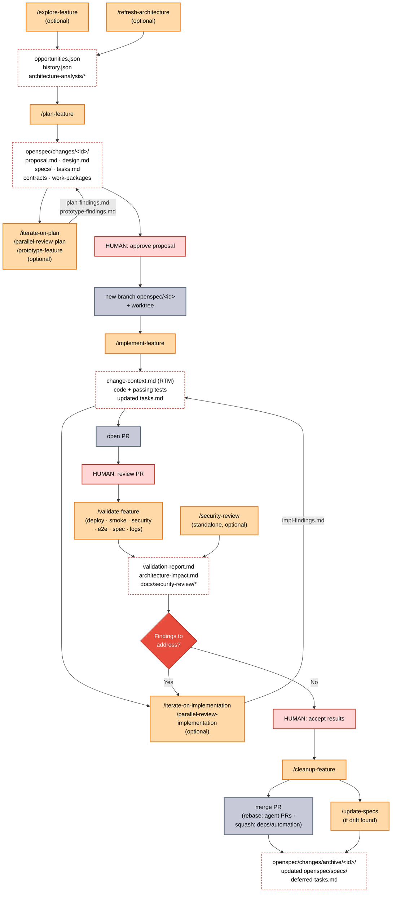
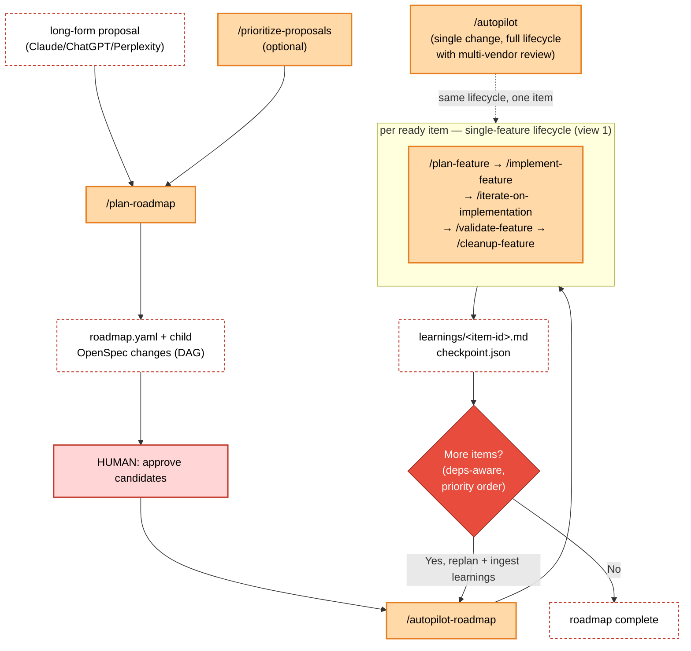
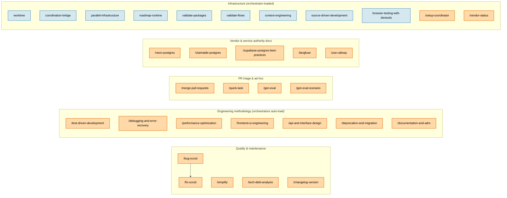

# Skill Flow

How the skills in this repo fit together, including the artifacts each one consumes
and produces. This is the visual companion to the prose in
[`skills-workflow.md`](../skills-workflow.md) and the index in
[`skills-catalogue.md`](../skills-catalogue.md).

The diagrams below are [Mermaid](https://mermaid.js.org/) — they render inline on
GitHub and stay diff-able as the workflow evolves. Three coordinated views:

1. [Single-feature lifecycle](#1-single-feature-lifecycle) — the canonical
   `explore → plan → implement → validate → cleanup` flow, with human gates,
   refinement loops, and artifacts.
2. [Roadmap orchestration](#2-roadmap-orchestration) — how `plan-roadmap` /
   `autopilot` wrap the lifecycle for multi-change initiatives.
3. [Supporting-skill map](#3-supporting-skill-map) — quality, methodology,
   vendor, and infrastructure skills that hang off the lifecycle.

## Legend

| Shape / colour | Meaning |
|---|---|
| 🟧 Orange box | A **skill** (slash command an operator or orchestrator invokes) |
| 🟥 Pink box | A **human approval gate** — work stops here until a person approves |
| ⬜ Dashed box | An **artifact** produced or consumed (file on disk, branch, PR) |
| 🔶 Red diamond | A **decision / retry loop** (mirrors the "Max N times" loops in the setup) |
| 🟦 Grey box | A **git/process state** (new branch, PR, merge) |

---

## 1. Single-feature lifecycle

The core flow. Every skill ends at a natural handoff point where a human reviews
and approves before the next stage begins. Optional refinement and review skills
loop back into their stage before the gate.

### What flows where

| Stage | Skill(s) | Consumes | Produces | Gate |
|---|---|---|---|---|
| Discovery | `explore-feature`, `refresh-architecture` | specs, active changes, code signals | `opportunities.json`, `history.json`, `architecture-analysis/*` | none |
| Plan | `plan-feature` (+ `iterate-on-plan`, `parallel-review-plan`, `prototype-feature`) | discovery context, existing specs | `proposal.md`, `design.md`, `specs/`, `tasks.md`, contracts, work-packages, `plan-findings.md` | **approve proposal** |
| Implement | `implement-feature` (+ `iterate-on-implementation`, `parallel-review-implementation`) | approved proposal/spec/tasks | branch `openspec/<id>`, `change-context.md`, tests, PR, `impl-findings.md` | **review PR** |
| Validate | `validate-feature`, `security-review` | running system, spec scenarios, changed files | `validation-report.md`, `architecture-impact.md`, `docs/security-review/*` | **accept results** |
| Cleanup | `cleanup-feature`, `update-specs` | approved PR, `tasks.md` completion | archived change, updated `openspec/specs/`, merged PR | none (mechanical) |

---

## 2. Roadmap orchestration

For long-form proposals describing 3+ capabilities, the roadmap layer **wraps**
the single-feature lifecycle: it decomposes the proposal into a dependency DAG of
OpenSpec changes, then drives each one through the lifecycle above with learning
feedback between items. `autopilot` does the same for a single change end-to-end.

---

## 3. Supporting-skill map

Skills that aren't stages of the lifecycle but plug into it — grouped by purpose
(matching [`skills-catalogue.md`](../skills-catalogue.md)). Quality skills keep the
codebase healthy, methodology skills encode disciplines that orchestrators auto-load,
vendor skills are authority docs for external services, and infrastructure skills are
the machinery the workflow skills call.

**How these connect to the lifecycle:**

- `bug-scrub` → `fix-scrub` is a diagnose/remediate pair you run any time, independent of a change.
- Methodology skills are loaded *by* `implement-feature` / `iterate-on-implementation` when the work touches their domain (e.g. `test-driven-development` shapes the RED→GREEN task ordering; `source-driven-development` and `context-engineering` are loaded automatically by the orchestrator skills).
- `merge-pull-requests` is the multi-source merge gate (it, `update-specs`, and `cleanup-feature` are the **sync-point skills** that touch `main` directly).
- Vendor skills are referenced by `source-driven-development` as primary sources when implementation code touches those services.
- Infrastructure skills (`worktree`, `parallel-infrastructure`, `coordination-bridge`, `roadmap-runtime`) provide isolation, DAG scheduling, coordinator transport, and roadmap state to the workflow skills above.

---

## Editing these diagrams

Edit the Mermaid code blocks in this file directly — GitHub re-renders on push. To
preview locally, paste a block into the [Mermaid Live Editor](https://mermaid.live)
or use any Markdown previewer with Mermaid support. Keep the four `classDef` styles
consistent across views so the colour grammar in the legend holds.
