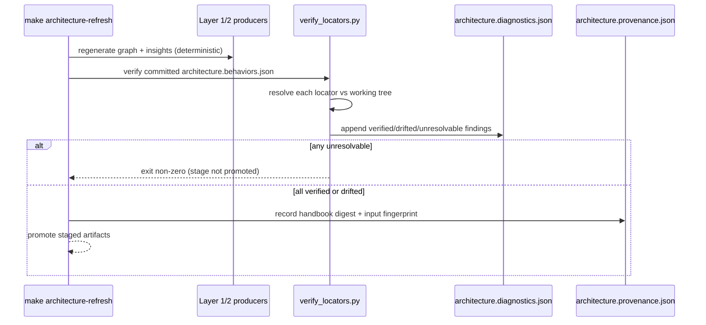
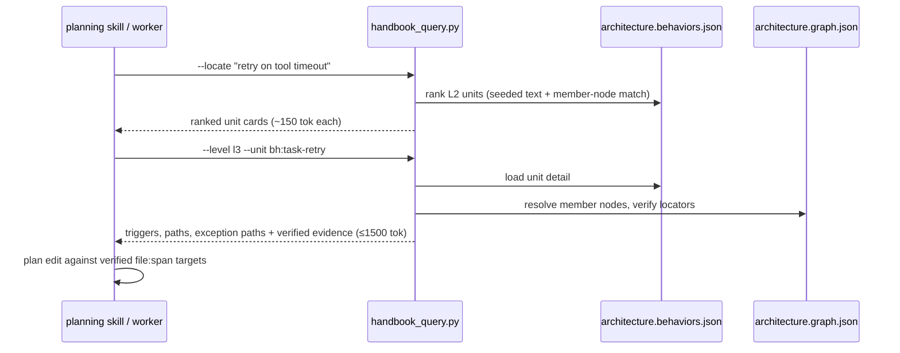

# Design: add-behavior-handbook-layer

## Context

The `refresh-architecture` pipeline is a three-layer deterministic system: Layer 1 per-language analyzers emit `python_analysis.json` / `ts_analysis.json` / `postgres_analysis.json`; Layer 2 compiles them into `architecture.graph.json` (1909 nodes / 1160 edges at last refresh) plus insights (`high_impact_nodes.json`, `parallel_zones.json`, `treesitter_enrichment.json`); Layer 3 renders reports and Mermaid views. Freshness is content-based and mtime-independent, recorded in `architecture.provenance.json` with SHA-256 digests, an input fingerprint, and `SOURCE_DATE_EPOCH`-clocked determinism (`architecture.summary.json` currently reports `cross_layer_flows: []` and 96 `disconnected_endpoints` — the structural graph cannot narrate behaviors).

The Harness Handbook paper (arXiv 2607.13285) shows that a behavior-centric map — L1 system flow, L2 behavior units, L3 unit detail with verified evidence — consumed via Behavior-Guided Progressive Disclosure improves edit-plan quality while reducing planner tokens. This change adds that map as **Layer 2.5** of the existing pipeline.

Constraint inherited from the `codebase-analysis` spec: `architecture.graph.json` is the single source of truth for structural relationships. The handbook must therefore *reference* graph nodes, never restate structure.

Constraint inherited from the pipeline: two refreshes at the same revision must be byte-identical. LLM-assisted synthesis is inherently nondeterministic, so synthesis and verification must be split (see Decision 2).

## Goals / Non-Goals

**Goals**

- G1: A committed `architecture.behaviors.json` with L1/L2/L3 content, schema-validated, referencing canonical node IDs.
- G2: Evidence locators that verify against HEAD, with drift surfaced through the existing diagnostics + freshness gate.
- G3: A level-at-a-time query CLI with explicit token budgets, usable by planning skills as a context-packing source.
- G4: A self-contained HTML drill-down with persona entry presets (newcomer / reviewer / planner / auditor).
- G5: An eval scenario that measures behavior-localization accuracy and tokens-to-localization against archived ground truth.

**Non-Goals**

- Replacing or modifying the canonical graph schema, existing analyzers, or `parallel_zones.json`.
- Whole-repo behavior coverage in the first iteration — synthesis targets `agent-coordinator/` first (WP1–WP3), expansion is a follow-up.
- Per-persona forked documents. One map, multiple entry points.
- Runtime BGPD inside the coordinator API — the query CLI is file-based; an MCP/API surface is deferred.
- Auto-regenerating the behavior map on every refresh (see Decision 2 — verification runs every refresh, synthesis is explicit).

## Decisions

### D1: Handbook is a Layer 2.5 artifact that references, never restates, the graph

Behavior units carry `member_nodes[]` of canonical node IDs (`py:...`, `ts:...`, `pg:...`). The handbook validator rejects any ID absent from `architecture.graph.json`. Structural queries (calls, imports) stay on the graph; the handbook adds only grouping, narrative, and paths.

*Alternative rejected:* embedding code snippets or call edges in the handbook — duplicates the graph, doubles drift surface.

### D2: Split nondeterministic synthesis from deterministic verification

Two commands with different cadences:

- `make architecture-handbook-synthesize` — **explicit, human/agent-initiated.** Runs `synthesize_behaviors.py`, which builds deterministic seed clusters (Decision D4), then invokes an LLM structuring step to name units and write narratives. Output is reviewed and committed like source. The synthesis prompt and model ID are recorded in the artifact's `snapshot` block.
- `make architecture-refresh` / `architecture-check` — **every refresh.** Runs `verify_locators.py` + schema validation only: deterministic, no LLM. Re-verifying a committed handbook at the same revision is byte-stable, preserving the repeat-refresh-no-diff invariant.

This mirrors how the repo already treats other synthesized-but-committed content (specs, reports): generation is an event; verification is continuous.

*Alternative rejected:* LLM synthesis inside `architecture-refresh` — breaks determinism, adds API-key dependency to a gate that CI and `affected_tests.py` rely on.

### D3: Locator = node ID + file + span + content digest, verified at read and check time

```json
{
  "node_id": "py:coordination_api.claim_task",
  "file": "agent-coordinator/src/coordination_api.py",
  "span": {"start": 210, "end": 244},
  "content_digest": "sha256:...",
  "role": "execution_path",
  "note": "atomic claim via SELECT ... FOR UPDATE SKIP LOCKED"
}
```

Resolver classification: `verified` / `drifted` (symbol resolves, digest differs) / `unresolvable`. `drifted` → warning + stale reason code (`handbook_locator_drift`); `unresolvable` → error, `architecture-check` exits non-zero. The digest is computed over the normalized (whitespace-stripped-EOL) spanned lines so formatting-only churn doesn't thrash.

*Alternative rejected:* line numbers only (silently rot) and full-file digests (over-invalidate: any edit anywhere in a file would drift every locator in it).

### D4: Deterministic seeding before LLM structuring

`synthesize_behaviors.py` first builds candidate clusters without any LLM:

1. Start from `entrypoints[]` (each entrypoint roots a candidate flow).
2. Expand along call/api_call/db_access edges to collect member nodes per root.
3. Merge clusters sharing >50% membership; attach `high_impact_nodes` as hub annotations.
4. Attach exception patterns from `treesitter_enrichment.json` to the cluster owning their nodes.
5. Every entrypoint not absorbed by a cluster (today: the 96 disconnected ones) goes to `uncovered[]` with reason `no_traced_flow` — the LLM step may claim them into units with narrative evidence, shrinking `uncovered[]`.

The LLM step then only names, groups, and narrates over this fixed skeleton — it cannot invent members. Any sentence without a resolvable locator is rejected at generation time.

### D5: Token budgets are schema-enforced, not advisory

The query CLI measures serialized output and the validator enforces caps at synthesis time: L1 overview ≤ ~400 tokens; each L2 card ≤ ~150; each L3 detail ≤ ~1500 (estimated at 4 chars/token; recorded in the artifact as `budget_estimate`). Overlong content fails validation and must be tightened or split into two units. This is the paper's core mechanism — token savings come from never loading L3 for units you didn't need — so budget violations are defects, not style issues.

### D6: One HTML artifact, persona as entry preset

`generate_handbook_html.py` embeds `architecture.behaviors.json` as a JSON island in a single self-contained page (pattern proven by `apps/kanban-viz/index.html`): no external requests, works offline and as a claude.ai artifact. Personas are URL-hash/UI presets over the same data — newcomer `#l1`, reviewer `#l2?files=a,b`, planner `#locate`, auditor `#exceptions` — not separate builds.

### D7: Evaluation via gen-eval against archived ground truth

Scenario pack in `packages/agent-scenarios`: for ~20 archived changes (`openspec/changes/archive/`), the request text from `proposal.md` is the input and the historically touched files are ground truth. Two arms — graph-only context vs. handbook `--locate` + progressive disclosure. Metrics: localization precision/recall at file level, planner tokens consumed to first correct localization. Runs through `agent-coordinator/evaluation/harness.py`. Adoption gate for expanding beyond `agent-coordinator/`: handbook arm must beat graph-only on localization F1 without exceeding its token budget.

## Alternatives Considered

Captured per-decision above; proposal-level alternatives (standalone skill; prompt-time-only synthesis) are in `proposal.md` §Approaches Considered.

## Risks / Trade-offs

| Risk | Likelihood | Impact | Mitigation |
|---|---|---|---|
| LLM synthesis hallucinates behavior narratives | Medium | High | D4 fixed skeleton (LLM cannot add members); locator-backed-or-rejected rule; human review of committed map |
| Locator churn on active code creates check noise | High | Medium | Normalized span digests; `drifted` = warning not error; `handbook_query` still serves drifted units marked unverified |
| Behavior map goes stale between explicit synth runs | Medium | Medium | Continuous verification narrows staleness to *narrative* drift; stale reason codes name affected units so re-synthesis is targeted, not global |
| Token-budget caps force lossy narratives | Medium | Low | Split-unit escape hatch (D5); budgets are calibration parameters in one config block |
| Eval ground truth biased (archived changes reflect old layout) | Medium | Medium | Restrict scenarios to changes whose touched files still exist at HEAD; report coverage of excluded scenarios |
| Pipeline complexity growth in refresh-architecture | Low | Medium | Handbook stages live in dedicated scripts with own tests; refresh only gains a verify step |

Trade-off accepted: the committed behavior map is a curated artifact, not a pure function of source. That is deliberate — it is what makes it reviewable, diffable, and cheap to read; the verification layer is what keeps it honest.

## Migration Plan

Rollout is additive and staged (details in `tasks.md`):

1. **Schema + validator + locator resolver** land first with no committed handbook — all tooling no-ops gracefully when `architecture.behaviors.json` is absent (`architecture-check` treats "no handbook" as fresh-by-absence, not an error).
2. **First synthesis** scoped to `agent-coordinator/`; the map is committed via normal review on this change's branch.
3. **Freshness integration** flips on: once a handbook is committed, provenance records it and `architecture-check` verifies it.
4. **Query CLI + HTML view** land once a committed map exists to serve.
5. **Eval scenario** runs; results recorded in the validation report and gate whole-repo expansion (a follow-up change).

Rollback: delete `architecture.behaviors.json` + `views/handbook.html`, drop the handbook keys from provenance (additive keys, ignored by older tooling), and remove the Make targets. No existing artifact or consumer changes shape at any step, so rollback at any stage is a file deletion, not a migration.

### Sequence — refresh-time verification (cross-layer)



### Sequence — planner consumption (BGPD)


