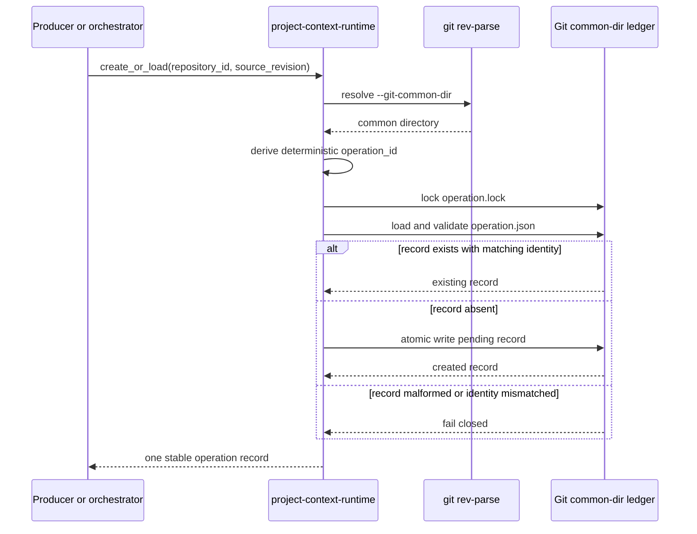
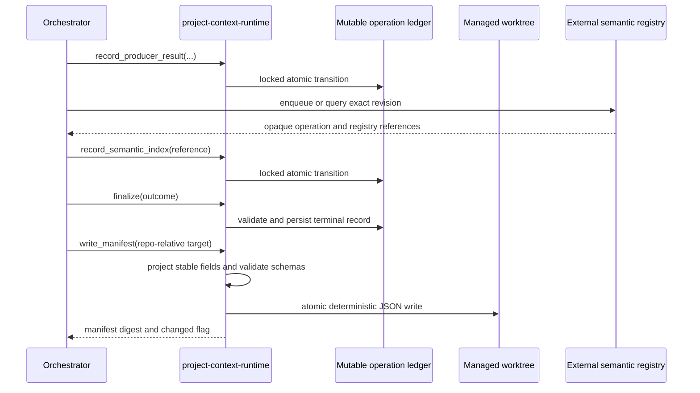

# Design: Add Durable Context Refresh Records

## Context

The codebase has several useful but incompatible durability patterns:

- `skills/roadmap-runtime` stores `checkpoint.json`, but its model is specific
  to roadmap execution and its current writer is not cross-process locked or
  crash-safe.
- `skills/parallel-infrastructure` writes atomic review manifests, but those
  records describe vendor findings rather than project-context freshness.
- `skills/refresh-architecture/scripts/rpc_server.py` exposes refresh IDs, but
  the server's status is subprocess-local; the coordinator client explicitly
  treats a later subprocess as potentially unavailable.
- Semantic indexing has its own external registry and must not be represented
  as though database state were committed to Git.

The architecture snapshot identifies shared skill runtimes as the dependency
boundary used by orchestrating skills. This change follows that relationship:
`project-context-runtime` is a non-user-invocable shared library consumed by
later producer and orchestration changes. It does not become a main writer and
does not replace producer ownership.

## Goals / Non-Goals

### Goals

- Give one repository revision one stable refresh-operation identity.
- Make mutable operation status readable after process exit and shared across
  managed worktrees in the same clone.
- Provide strict, versioned models for operation state, producer results,
  changed repository artifacts, validation results, and semantic-index
  references.
- Produce a byte-deterministic manifest suitable for staging and committing.
- Make concurrent create/update operations crash-safe and idempotent.
- Fail closed on unknown schema versions, malformed state, unsafe paths, and
  invalid state transitions.

### Non-goals

- Implement the refresh orchestrator or invoke any producer.
- Add coordinator API, MCP, or Postgres persistence.
- Define semantic indexing's internal registry schema.
- Push, commit, archive OpenSpec changes, or write main.
- Provide cross-clone or cross-machine operation lookup.
- Garbage-collect operation records automatically.

## Decisions

### D1: Create a dedicated shared runtime

Add a non-user-invocable `skills/project-context-runtime/` library rather than
placing context records in `roadmap-runtime`, `refresh-architecture`, or the
coordinator.

The runtime owns:

```text
skills/project-context-runtime/
├── SKILL.md
├── scripts/
│   ├── models.py
│   ├── atomic.py
│   ├── store.py
│   └── manifest.py
└── install_assets/openspec/schemas/
    ├── context-refresh-types.schema.json
    ├── context-refresh-operation.schema.json
    └── context-refresh-manifest.schema.json
```

This keeps imports one-way: producer/orchestrator skills import the runtime;
the runtime does not import producer implementations.

Alternative: extend `roadmap-runtime`. Rejected because refresh operations are
not roadmap checkpoints and will also be used by direct/manual and merge
flows.

### D2: Key operations by repository ID and exact source revision

Callers supply a canonical `repository_id` and a full 40- or 64-character Git
object ID. The operation ID is:

```text
pcr-<first 24 hex chars of sha256(
  "context-refresh-v1\0" + repository_id + "\0" + source_revision
)>
```

The domain prefix prevents reuse of the hash in another namespace. The full
identity tuple remains in the record and is verified on every load, so a hash
collision or misplaced directory fails closed.

Alternative: use UUIDs. Rejected because retries could create duplicate
operations without an additional lookup index.

Alternative: key only by source revision. Rejected because the same commit ID
can be meaningful in multiple repositories and storage adapters may later
serve more than one repository.

### D3: Store mutable records in the Git common directory

The default filesystem adapter stores:

```text
<git-common-dir>/project-context/refresh-operations/
└── <operation-id>/
    ├── operation.json
    └── operation.lock
```

`git rev-parse --git-common-dir` is resolved to an absolute path. This makes
all linked worktrees in a clone share the ledger while keeping retry attempts,
timestamps, errors, and lock files out of repository commits.

Each mutation acquires an exclusive advisory lock on `operation.lock`, loads
and validates the current record, applies one transition, increments
`record_revision`, then writes `operation.json` by:

1. creating a temporary file in the same directory;
2. writing canonical JSON and flushing it;
3. fsyncing the temporary file;
4. replacing the destination with `os.replace`;
5. fsyncing the parent directory.

The lock covers create-or-load as well as updates. Readers validate the
complete record and never infer a default status from a missing or partial
file.

Alternative: store under the worktree. Rejected because feature worktrees
would create independent operation identities and status.

Alternative: use SQLite. Rejected for v1 because a single-record-per-directory
layout is sufficient, inspectable, and avoids migration machinery. The typed
store interface permits another adapter later.

### D4: Separate mutable operation records from deterministic manifests

`operation.json` is an execution ledger. It includes timestamps, attempt
number, current state, producer results, semantic-index reference, and the
manifest write status. It is not a Git artifact.

The committed manifest is a projection with only stable fields:

- schema and operation identity;
- repository ID and source revision;
- the operation's stable creation timestamp;
- final refresh outcome;
- producer IDs, versions, statuses, validations, remediation, and fallbacks;
- changed repository artifact paths, change kinds, and content digests;
- semantic-index operation/registry references and indexed/requested
  revisions;
- top-level validation summary.

It excludes update timestamps, attempt counters, lock owners, temporary paths,
absolute paths, and exception traces. Arrays are sorted by documented stable
keys and JSON is emitted with UTF-8, two-space indentation, sorted object keys,
and one trailing newline. Rewriting the same projection is a no-op.

The manifest target is caller-supplied and must be repository-relative. The
later orchestrator selects its canonical path; this change does not claim a
main-writing location.

Alternative: commit `operation.json`. Rejected because retry metadata would
produce nondeterministic convergence diffs and expose local execution details.

### D5: Use strict Draft 2020-12 contracts

Three schemas separate shared definitions from the two top-level documents:

- `context-refresh-types.schema.json` defines producer results, validations,
  repository artifacts, remediation, fallbacks, Git revisions, and
  semantic-index references.
- `context-refresh-operation.schema.json` defines the mutable ledger.
- `context-refresh-manifest.schema.json` defines the deterministic projection.

All top-level schemas require `schema_version: 1` and set
`additionalProperties: false`. Readers reject any other version before model
construction. Relative schema references are resolved from an explicit local
registry; schema loading never fetches network resources.

Alternative: Python dataclasses without machine-readable contracts. Rejected
because later skills and non-Python consumers need a stable coordination
boundary.

### D6: Model truthful statuses and fallbacks

Operation states are:

```text
pending -> running -> succeeded
                   -> degraded
                   -> failed
failed   -> running
degraded -> running
```

`succeeded` is terminal. A retry from `failed` or `degraded` increments
`attempt`; duplicate `begin_attempt` while already `running` returns the
current record without incrementing it.

Producer status is exactly `fresh`, `degraded`, `failed`, or
`not-configured`. Every producer result includes a remediation array; non-fresh
results require at least one actionable entry. `degraded` and
`not-configured` results also require an explicit fallback.

Semantic-index state is represented separately as an opaque durable operation
and registry reference. Any state other than `succeeded` requires an explicit
fallback. Runtime validation additionally requires a succeeded index's
`indexed_revision` to equal `requested_revision`; mismatches are rejected
rather than marked current.

Alternative: collapse all producer and operation statuses into one enum.
Rejected because a completed refresh can legitimately be degraded while
individual producers have different outcomes.

### D7: Persist safe diagnostics only

Paths in contracts are repository-relative POSIX paths without `..`, a leading
slash, backslashes, or NUL. Artifact content is represented by SHA-256 digest,
not embedded bytes. Errors use a bounded class, summary, and remediation shape;
tracebacks, environment variables, credentials, and raw subprocess output are
not persisted.

Alternative: store full exceptions for debugging. Rejected because producer
exceptions can include secrets and machine-local paths. Callers may log richer
diagnostics to their existing protected logging sink.

## Cross-layer flows

### Create or resume an operation



### Record results and emit the deterministic manifest



## Risks / Trade-offs

| Risk | Consequence | Mitigation |
|---|---|---|
| Two processes update one operation | Lost producer result or invalid terminal state | Per-operation advisory lock, reload-under-lock, monotonic `record_revision` |
| Crash during write | Partial or missing status | Same-directory temp file, file fsync, atomic replace, parent fsync |
| Clone-local ledger is unavailable on another machine | Remote caller cannot query in-flight state | Document clone-local scope; keep store behind an adapter boundary |
| Repository identity changes | Same commit receives a new operation ID | Require canonical repository ID from caller and document migration as a new identity |
| Schema references accidentally fetch the network | Offline validation fails or trusts mutable remote content | Register all three local schemas explicitly and prohibit remote resolution |
| Error payload leaks secrets | Durable sensitive data exposure | Bounded sanitized error model; no traceback, raw stderr, environment, or absolute paths |
| A failed semantic index appears current | Coding jobs consume stale context | Separate index reference, exact requested/indexed revision validation, mandatory fallback unless succeeded |
| Operation records accumulate | Git common directory grows | Records are small; manual repository-scoped cleanup is documented, automatic GC deferred |

## Migration Plan

1. Add the three contracts and model tests.
2. Add the runtime with no consumers; existing refresh behavior is unchanged.
3. Prove create/resume and manifest emission across separate processes and
   linked worktrees.
4. Install schemas into a fixture consumer repository and validate relative
   references offline.
5. Let downstream roadmap changes adopt the runtime one producer or
   orchestrator at a time.

No existing status file is migrated automatically. The later
architecture-refresh change may translate an in-flight legacy refresh into a
new operation or start a new operation for the exact source revision.

### Rollback

Before downstream adoption, remove the additive runtime and schemas. After
adoption, first roll consumers back to their prior status mechanism, then
remove the runtime. Do not downgrade or rewrite v2+ records as v1; preserve
them for inspection and fail closed. Removing tracked code never requires
deleting operation records from the Git common directory.
