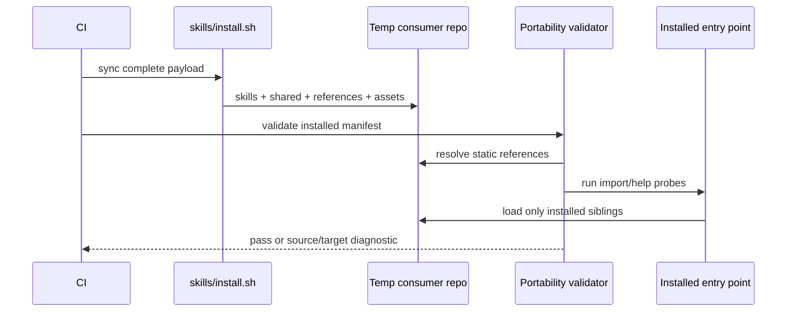

# Design: enforce-skill-install-portability

## Context

`skills/install.sh` copies every directory containing `SKILL.md`, plus `skills/shared/`, `skills/references/`, and skill-owned OpenSpec assets. The installed destination is `.claude/skills/` or `.agents/skills/`; top-level `skills/`, coordinator sources, repo documentation, and the source Makefile are not part of that runtime closure.

The repository already documents sibling-relative infrastructure imports, but enforcement is partial. The direct-import linter only matches three Python import forms on an externally supplied changed-file list. Tests generally import from the source tree, where coordinator code and canonical paths mask installed-layout failures.

## Goals / Non-Goals

### Goals

- Define the installed payload as an explicit dependency boundary.
- Make every selected skill importable and its baseline documented commands resolvable in a clean consumer.
- Preserve one canonical PR classifier while reversing the current dependency direction.
- Detect future violations in code, shell, hooks, and documentation before sync.
- Keep optional coordinator and source-repository integrations available through explicit configuration and public interfaces.

### Non-Goals

- Bundle third-party executables such as `gh`, Docker, Railway, or OpenSpec.
- Guarantee that consumer-specific project inputs, services, or credentials exist.
- Redesign coordinator APIs unrelated to portable skill configuration.
- Modify generated runtime mirrors by hand.

## Decisions

### D1: The install manifest is the runtime trust boundary

The installer-selected skill directories, `shared/`, `references/`, and installed OpenSpec assets form the only repo-owned runtime closure available to consumers. Validation classifies references to third-party tools and explicitly documented consumer project paths separately from missing repo-owned dependencies.

### D2: Shared reusable logic belongs in `skills/shared/`

The PR classifier moves to a shipped shared module. The merge skill imports it from its co-installed `shared/` sibling, while the coordinator loads the same source without requiring skills to import coordinator internals.

### D3: Runtime paths derive from the loaded artifact

Python uses `Path(__file__)`; shell uses `${BASH_SOURCE[0]}`; installed hook commands record the concrete discovered mirror path. Cross-skill references resolve through the installed skills root rather than the consumer repository root.

### D4: Public coordination interfaces replace private imports

Model/archetype lookup, coordinator configuration, and agent discovery use `coordination-bridge`, HTTP/MCP endpoints, explicit configuration, or deterministic local fallbacks. Help/import paths never require coordinator modules.

### D5: Consumer validation combines dynamic probes with static closure analysis

Dynamic probes catch import and startup failures in the actual rsynced layout. Static analysis covers paths that are optional or unsafe to invoke automatically, including computed traversal, subprocess code strings, shell hooks, and Markdown links. Both operate on the complete payload and are blocking.

### D6: Repository-scoped behavior must be explicit

Source-only assumptions are converted to configurable behavior where practical. If a skill genuinely cannot function outside this repository, the installer must omit it through an explicit distribution declaration rather than silently ship a broken copy.

## Cross-Layer Flow

## Alternatives Considered

- Duplicate helpers into each skill: rejected because it recreates behavioral drift.
- Keep coordinator as the shared package: rejected because consumers do not receive it and dependency direction would remain inverted.
- Exclude all coupled skills: rejected as the default because most can be made portable with explicit configuration; retained only for intentionally repository-scoped capabilities.
- Scan changed files only: rejected because an installer change can expose an old violation in an unchanged file.

## Risks / Trade-offs

| Risk | Mitigation |
|---|---|
| Static scanner reports consumer-owned paths as violations | Maintain explicit classifications and test allowlisted project inputs. |
| Moving classifier ownership breaks coordinator imports | Preserve the coordinator module as a compatibility adapter or loader and run both classifier suites. |
| Path normalization touches many skill instructions | Make mechanical updates separately from behavior changes and validate every installed mirror. |
| Concurrent active changes touch shared skills | Keep commits task-scoped, rebase before PR, and report conflicting files in the handoff. |
| Optional integrations become silently disabled | Require actionable diagnostics and tests for degraded behavior. |

## Migration Plan

1. Land failing clean-consumer tests and expanded static checks.
2. Move shared classifier behavior and repair confirmed import failures.
3. Normalize runtime path/configuration discovery across affected scripts and instructions.
4. Run the full skills suite and installed-consumer gate.
5. Run `skills/install.sh` from canonical sources to regenerate runtime mirrors for verification; do not commit hand-edited mirrors.
6. Roll back by reverting feature commits; no data migration is required.
