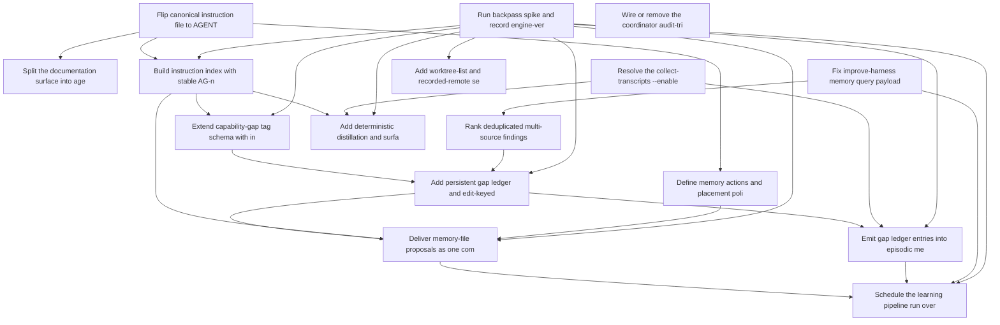

# Roadmap: backpass-memory-alignment

> Source: `docs/proposals/backpass-memory-alignment.md` | Status: **planning** | Items: 16

<!-- GENERATED: begin phase-table -->
## Phase Table

| Priority | Item | Effort | Status | Dependencies |
|----------|------|--------|--------|--------------|
| 1 | Run backpass spike and record engine-versus-port decision | M | candidate | - |
| 1 | Fix improve-harness memory query payload and capability_gap tag matching | M | candidate | - |
| 2 | Flip canonical instruction file to AGENTS.md with CLAUDE.md import pointer | M | candidate | - |
| 2 | Define memory actions and placement policy in the documentation guide | M | candidate | ri-02 |
| 2 | Rank deduplicated multi-source findings in analyze_failures | S | candidate | ri-05 |
| 2 | Resolve the collect-transcripts --enable contract: implement or amend | L | candidate | - |
| 3 | Split the documentation surface into agent-memory and docs in context-impact rules | S | candidate | ri-02 |
| 3 | Wire or remove the coordinator audit-triage classifier | S | candidate | - |
| 3 | Build instruction index with stable AG-nnn ids and memory-surface hash | M | candidate | ri-01, ri-02 |
| 3 | Extend capability-gap tag schema with instruction, polarity, class, and domain prefixes | S | candidate | ri-01, ri-09 |
| 3 | Add deterministic distillation and surface-hash evidence cache to collect-transcripts | L | candidate | ri-01, ri-07, ri-09 |
| 3 | Add persistent gap ledger and edit-keyed rejection ledger to improve-harness | L | candidate | ri-01, ri-06, ri-10 |
| 4 | Add worktree-list and recorded-remote session association to transcript adapters | M | candidate | ri-01 |
| 4 | Emit gap ledger entries into episodic memory as transcript-mined findings | M | candidate | ri-01, ri-07, ri-13 |
| 4 | Deliver memory-file proposals as one commit per edit with proposal.json | L | candidate | ri-01, ri-03, ri-09, ri-13 |
| 5 | Schedule the learning pipeline run over the always-loaded surface | M | candidate | ri-01, ri-05, ri-14, ri-15 |
<!-- GENERATED: end phase-table -->

<!-- GENERATED: begin dependency-dag -->
## Dependency Graph

<!-- GENERATED: end dependency-dag -->

<!-- GENERATED: begin item-details -->
## Item Details

### ri-01: Run backpass spike and record engine-versus-port decision

- **Status**: candidate
- **Priority**: 1
- **Effort**: M
- **Change ID**: spike-backpass-engine-versus-port

Install backpass, write a .backpassrc.json pointing memoryFiles at AGENTS.md and CLAUDE.md and skillsDir at skills/, run scan, status, and one full proposal run (never apply) against this checkout, and record the always-loaded budget bar, a per-edit evidence review of the first proposal, and a comparison of its orchestration-domain diagnostics against /improve-harness. Write the engine-versus-port decision as a capability-timeline entry in docs/decisions/.

**Acceptance outcomes**:
- [ ] .backpassrc.json exists with memoryFiles [AGENTS.md, CLAUDE.md], skillsDir skills, and a discovery.since covering the autopilot history; .backpass/ is excluded from git via .git/info/exclude.
- [ ] A dated context-cost baseline file records the backpass budget bar (memory file plus all skill descriptions, bytes/4) alongside the /doctor figure used by skill-rightsizing ri-04.
- [ ] A review table lists every edit in the first backpass proposal with its action kind, quoted sessions, and a yes/no judgement on whether the evidence meets this repo's standard.
- [ ] The comparison of backpass orchestration-domain diagnostics against the /improve-harness report over the same window is recorded with counts of overlapping and unique findings.
- [ ] A docs/decisions/ capability-timeline entry states engine or port with the spike numbers attached, and no backpass apply was run against the shared checkout.

### ri-05: Fix improve-harness memory query payload and capability_gap tag matching

- **Status**: candidate
- **Priority**: 1
- **Effort**: M
- **Change ID**: fix-improve-harness-memory-query-contract

Make analyze_failures.py send the fields MemoryQueryRequest declares (including agent_id, dropping time_window_days) and match capability_gap:* tags by prefix instead of the bare capability_gap tag, either by expanding tags client-side or by adding a prefix predicate to the coordinator memory query; apply the same fix to skills/agent-metrics/scripts/query_metrics.py. Add a test against a fake or live coordinator.

**Acceptance outcomes**:
- [ ] POST /memory/query issued by analyze_failures.py passes MemoryQueryRequest validation (test asserts a 200 from a fake coordinator with the exact payload).
- [ ] A memory entry tagged capability_gap:missing-retry is returned by the improve-harness query and by query_metrics.py; a test seeds such an entry and asserts it appears.
- [ ] GitHub issue #493 is closed by the merged change.

### ri-02: Flip canonical instruction file to AGENTS.md with CLAUDE.md import pointer

- **Status**: candidate
- **Priority**: 2
- **Effort**: M
- **Change ID**: flip-canonical-instruction-file-to-agents-md

Replace the AGENTS.md symlink with a self-contained canonical AGENTS.md and rewrite CLAUDE.md as a Claude-specific preamble (Sub-Agent Authorization block) ending in @AGENTS.md. Retarget test_claude_md_restructure.py, README.md line 7, the context-engineering skill, the skill-workflow spec text that says either file may exceed 300 lines, and the three skills that describe the two files as divergent.

**Acceptance outcomes**:
- [ ] AGENTS.md is a regular file (git mode 100644) containing the full shared contract, and CLAUDE.md contains only Claude-specific content followed by a final @AGENTS.md line.
- [ ] skills/session-log/tests/test_claude_md_restructure.py asserts the line cap against AGENTS.md and passes.
- [ ] README.md, skills/context-engineering/SKILL.md, and openspec/specs/skill-workflow/spec.md no longer describe AGENTS.md as a symlink or as a second file that can diverge; grep for 'symlink' near AGENTS.md returns no stale hits in docs, specs, or skills.
- [ ] Codex-style consumers that ignore @ imports still receive the complete contract by reading AGENTS.md alone (verified by a test that AGENTS.md contains every section heading that the previous CLAUDE.md had, minus the Claude-specific block).

### ri-03: Define memory actions and placement policy in the documentation guide

- **Status**: candidate
- **Priority**: 2
- **Effort**: M
- **Change ID**: define-memory-actions-and-placement-policy
- **Depends on**: `ri-02`

Add a section to docs/guides/documentation.md defining the five memory actions (add, rewrite, remove, extract, move) with their evidence floors and mechanical checks, and a single what-goes-where placement policy that merges the keep/cut test, the broad/narrow/trigger table, and the progressive-disclosure tiers with measured relevance as the criterion. Reference the section from the skill-workflow spec.

**Acceptance outcomes**:
- [ ] docs/guides/documentation.md contains a table with exactly five actions, each row naming its evidence floor (2 distinct sessions with quotes; 2 sessions with harm for remove; exempt for extract and move) and its mechanical check.
- [ ] The same guide contains a placement section mapping broad (20 percent of sessions or safety) to AGENTS.md, narrow-with-trigger to a skill, and narrow-without-trigger to deletion, and states the corroboration unit chosen for this corpus (distinct changes or distinct interactive sessions).
- [ ] openspec/specs/skill-workflow/spec.md references the memory-actions section by path and no longer carries its own contradictory keep/cut wording.
- [ ] The extract action text states that every removed line must reappear in the created or extended SKILL.md and that the description delta is charged to the always-loaded budget.

### ri-06: Rank deduplicated multi-source findings in analyze_failures

- **Status**: candidate
- **Priority**: 2
- **Effort**: S
- **Change ID**: rank-deduplicated-multi-source-findings
- **Depends on**: `ri-05`

Make analyze_failures.py rank the deduplicated multi-source findings it already computes instead of raw memory entries, call generate_report_multi_source from main(), and make cross-source agreement a filter or ranking input rather than a printed percentage.

**Acceptance outcomes**:
- [ ] Running analyze_failures.py over a fixture with the same gap reported by two sources yields one ranked finding with source_count 2 rather than two raw entries.
- [ ] generate_report_multi_source is invoked from main() and its output section appears in the generated improvement report (asserted by test).
- [ ] GitHub issue #494 is closed by the merged change.

### ri-07: Resolve the collect-transcripts --enable contract: implement or amend

- **Status**: candidate
- **Priority**: 2
- **Effort**: L
- **Change ID**: resolve-collect-transcripts-enable-contract

Implement the --enable flag, define analyze_session_llm behind the repo's vendor routing, and make the CLIs write structured findings to episodic memory when enabled, keeping dry-run as the default. If the LLM path is deliberately deferred, amend the spec and SKILL.md instead so documentation matches the heuristic-only behaviour; the item is complete only when code and spec agree.

**Acceptance outcomes**:
- [ ] If the implement path is chosen: collect-transcripts --enable runs end to end on a fixture transcript and writes at least one episodic memory entry with a capability_gap:* tag and source:transcript-mined (verified against a fake coordinator).
- [ ] If the implement path is chosen: analyze_session_llm is defined, unit-tested with a stubbed model client, and discards any finding that lacks a verbatim quote.
- [ ] Without --enable both CLIs remain dry-run and write nothing; a test asserts zero memory writes.
- [ ] If the amend path is chosen: the spec and SKILL.md describe heuristic-only, print-only behaviour, the unused prompt files are removed, and the RI-12 scheduling assumption in docs/proposals/repo-improvement-roadmap.md is corrected.
- [ ] openspec/specs and skills/collect-transcripts/SKILL.md describe exactly the behaviour the code implements, and GitHub issue #495 is closed.

### ri-04: Split the documentation surface into agent-memory and docs in context-impact rules

- **Status**: candidate
- **Priority**: 3
- **Effort**: S
- **Change ID**: split-agent-memory-surface-in-context-impact-rules
- **Depends on**: `ri-02`

Replace the single documentation surface in openspec/schemas/context-impact-rules.yaml with an agent-memory surface (AGENTS.md, CLAUDE.md, SKILL.md frontmatter) and a docs surface (README, docs/guides, docs/proposals, docs/decisions), and have the documentation.inventory producer report the byte and estimated-token size of the agent-memory surface.

**Acceptance outcomes**:
- [ ] context-impact-rules.yaml validates against its schema with agent-memory and docs surfaces and no remaining documentation surface.
- [ ] A test asserts AGENTS.md, CLAUDE.md, and skills/*/SKILL.md frontmatter classify as agent-memory while README.md and docs/guides/*.md classify as docs.
- [ ] The documentation.inventory producer output includes agent_memory_bytes and agent_memory_tokens_est (bytes/4) fields and its check mode fails when the value exceeds a configured budget.

### ri-08: Wire or remove the coordinator audit-triage classifier

- **Status**: candidate
- **Priority**: 3
- **Effort**: S
- **Change ID**: wire-or-remove-audit-triage-classifier

Decide whether agent-coordinator/src/audit_triage.py is wired to a background task that runs over audit events or removed, record the decision, and implement it so the classifier is no longer documented-but-uncalled.

**Acceptance outcomes**:
- [ ] Either a background task invokes the classifier and an integration test shows an audit event producing a classification, or the module and its docs references are deleted and the test suite passes.
- [ ] The decision is recorded in docs/decisions/ or the coordinator README with the reason.
- [ ] GitHub issue #496 is closed by the merged change.

### ri-09: Build instruction index with stable AG-nnn ids and memory-surface hash

- **Status**: candidate
- **Priority**: 3
- **Effort**: M
- **Change ID**: build-instruction-index-and-surface-hash
- **Depends on**: `ri-01`, `ri-02`

Add a shared script that parses AGENTS.md into units (list items and paragraphs under headings), hashes each, assigns stable AG-nnn aliases that survive reordering, and computes a surface hash over the memory file plus every skill description line. Expose both as importable functions and a CLI.

**Acceptance outcomes**:
- [ ] Running the index CLI over AGENTS.md emits a JSON list of units each with id (AG-nnn), content hash, heading path, and line range; reordering two sections leaves every id unchanged.
- [ ] Editing one skill description changes the surface hash; editing README.md does not (asserted by test).
- [ ] The instruction index produced matches the ids backpass reported in the ri-01 spike for the same file version, or the difference is documented.

### ri-10: Extend capability-gap tag schema with instruction, polarity, class, and domain prefixes

- **Status**: candidate
- **Priority**: 3
- **Effort**: S
- **Change ID**: extend-capability-gap-tag-schema-with-evidence-prefixes
- **Depends on**: `ri-01`, `ri-09`

Add instruction:AG-nnn, polarity:positive|negative, class:harm|non-compliance|irrelevant, and domain:project|orchestration tag prefixes to the D4 tag schema, document them in docs/guides/memory-conventions.md, and update the session-log emitter and the collect-transcripts writer to emit them.

**Acceptance outcomes**:
- [ ] docs/guides/memory-conventions.md documents the four prefixes with allowed values and an example entry carrying all four.
- [ ] A memory entry written by collect-transcripts with --enable carries instruction:, polarity:, class:, and domain: tags when the finding is anchored to an instruction, and a test asserts the tag set.
- [ ] Queries by prefix (from ri-05) return entries filtered by polarity:negative and class:harm.

### ri-11: Add deterministic distillation and surface-hash evidence cache to collect-transcripts

- **Status**: candidate
- **Priority**: 3
- **Effort**: L
- **Change ID**: add-transcript-distillation-and-evidence-cache
- **Depends on**: `ri-01`, `ri-07`, `ri-09`

Insert a deterministic reduction pass before any model call (user and assistant turns verbatim, each tool call collapsed to one line, output truncated, scaffolding dropped, secrets redacted) and cache per-transcript evidence keyed on transcript content, surface hash, and analysis-index version. Report the measured reduction percentage and cache hit rate in the dry-run output.

**Acceptance outcomes**:
- [ ] Dry-run output prints original and distilled token estimates per transcript and the reduction is at least 90 percent on the golden fixtures.
- [ ] Distilled output for a fixture containing a fake API key contains no substring of that key (redaction test).
- [ ] Running twice over the same transcripts with an unchanged surface hash makes zero model calls on the second run; changing one skill description invalidates only the cached entries whose analysis referenced it.

### ri-13: Add persistent gap ledger and edit-keyed rejection ledger to improve-harness

- **Status**: candidate
- **Priority**: 3
- **Effort**: L
- **Change ID**: add-gap-and-rejection-ledgers-to-improve-harness
- **Depends on**: `ri-01`, `ri-06`, `ri-10`

Add a gap ledger that records sightings per gap and session across runs, graduates gaps at a corroboration floor counted in distinct changes or distinct interactive sessions, retires gaps when covered by an instruction or skill description, and expires them after 90 days; and a rejection ledger keyed on edit content that suppresses a rejected edit until strictly more evidence backs it. Report the interactive versus non-interactive split.

**Acceptance outcomes**:
- [ ] A gap seen in one interactive session and three autopilot sessions of the same change does not graduate; the same gap seen in two distinct changes does (asserted by test).
- [ ] A gap whose text is covered by a newly added instruction unit is retired on the next run, and a gap unseen for 90 days is expired.
- [ ] A rejected edit key is not re-proposed on a rerun with identical evidence and is re-proposed when one additional qualifying session backs it.
- [ ] The report prints relevance per instruction id split by interactive and non-interactive sessions.

### ri-12: Add worktree-list and recorded-remote session association to transcript adapters

- **Status**: candidate
- **Priority**: 4
- **Effort**: M
- **Change ID**: add-worktree-and-remote-session-association
- **Depends on**: `ri-01`

Extend the adapter base with tiered session-to-repo association: worktree cwd, sibling worktree from the git worktree list, recorded remote URL, and a dead-path tier that matches on repo name for sessions whose container path no longer exists. Label the tier on each association and make the best-effort tier opt-in.

**Acceptance outcomes**:
- [ ] A fixture session recorded under a deleted worktree path is associated with this repo via the dead-path tier and the association record names the tier.
- [ ] A fixture session from a sibling worktree is associated via the worktree-list tier without the best-effort flag.
- [ ] With the best-effort tier disabled, sessions matching only by repo name are excluded (asserted by test).

### ri-14: Emit gap ledger entries into episodic memory as transcript-mined findings

- **Status**: candidate
- **Priority**: 4
- **Effort**: M
- **Change ID**: emit-gap-ledger-as-transcript-mined-memory
- **Depends on**: `ri-01`, `ri-07`, `ri-13`

Write graduated gaps from the gap ledger (backpass's or the ported one) into episodic memory as source:transcript-mined entries carrying affected_skill, domain, and verbatim quotes, and route orchestration-domain gaps to the improve-harness report.

**Acceptance outcomes**:
- [ ] Each graduated gap produces exactly one memory entry with source:transcript-mined, domain:, affected_skill, and at least one verbatim quote; a gap that is not graduated produces none.
- [ ] Rerunning the emitter does not duplicate entries for already-emitted gaps (idempotency test).
- [ ] The improve-harness report generated from the emitted entries lists the orchestration-domain gaps under affected_skill headings.

### ri-15: Deliver memory-file proposals as one commit per edit with proposal.json

- **Status**: candidate
- **Priority**: 4
- **Effort**: L
- **Change ID**: deliver-memory-edits-as-commits-with-proposal-json
- **Depends on**: `ri-01`, `ri-03`, `ri-09`, `ri-13`

Build the proposal writer: edits are made on a staging copy, the diff is measured from the file and never taken from a model reply, each edit becomes one commit on a proposal branch with the action kind, instruction ids, and verbatim quotes in the commit body, and a proposal.json records edit keys for the rejection ledger. Enforce in code the per-action evidence floors, the max-edits-per-run cap, and the post-edit budget check, failing loudly after two re-prompts.

**Acceptance outcomes**:
- [ ] A run producing three edits yields a branch with exactly three commits, each body containing action kind, instruction ids, and quotes from at least two distinct qualifying sessions, plus a proposal.json listing three edit keys.
- [ ] An add edit that pushes the always-loaded surface over budget is rejected in code and the run fails after at most two re-prompts with the rejected proposal preserved on disk.
- [ ] A remove edit backed only by non-compliance evidence is rejected; an extract edit whose removed lines do not all reappear in the target SKILL.md is rejected (asserted by tests).
- [ ] Reverting one commit and rerunning records that edit key in the rejection ledger and does not re-propose it.

### ri-16: Schedule the learning pipeline run over the always-loaded surface

- **Status**: candidate
- **Priority**: 5
- **Effort**: M
- **Change ID**: schedule-always-loaded-surface-learning-run
- **Depends on**: `ri-01`, `ri-05`, `ri-14`, `ri-15`

Wire the scheduled learning pipeline so a recurring run executes backpass (or its port) over the memory surface, emits the gap ledger into memory, opens the proposal branch, and then runs /improve-harness over the orchestration-domain output; publish a run summary with the budget bar, edits proposed, and gaps graduated.

**Acceptance outcomes**:
- [ ] A scheduled workflow or routine definition exists that runs the pipeline end to end and completes on a fixture corpus in CI without manual steps.
- [ ] Each run publishes a summary containing the always-loaded token estimate, number of edits proposed, number of gaps graduated, and the interactive/non-interactive split.
- [ ] A run with no graduated gaps and a surface within budget opens no proposal branch and writes no memory entries.

<!-- GENERATED: end item-details -->

