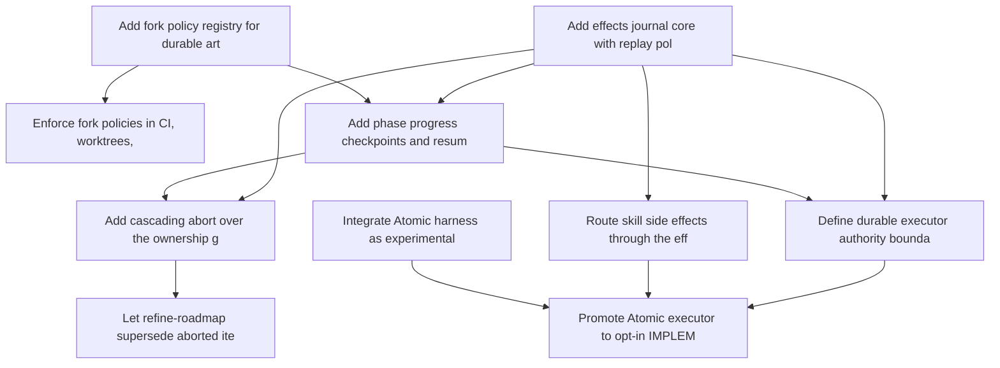

# Roadmap: durable-execution

> Source: `openspec/roadmaps/durable-execution/proposal.md` | Status: **planning** | Items: 9

<!-- GENERATED: begin phase-table -->
## Phase Table

| Priority | Item | Effort | Status | Dependencies |
|----------|------|--------|--------|--------------|
| 1 | Add effects journal core with replay policies | M | approved | - |
| 1 | Add phase progress checkpoints and resume in phase_agent | L | approved | ri-01, ri-03 |
| 2 | Route skill side effects through the effects journal | L | approved | ri-01 |
| 2 | Add fork policy registry for durable artifacts | M | approved | - |
| 2 | Add cascading abort over the ownership graph | L | approved | ri-01, ri-05 |
| 3 | Enforce fork policies in CI, worktrees, and sync points | M | approved | ri-03 |
| 3 | Let refine-roadmap supersede aborted items | S | approved | ri-06 |
| 3 | Define durable executor authority boundary contract | M | approved | ri-01, ri-05 |
| 4 | Integrate Atomic harness as experimental vendor with workflow-dispatch pilot | L | approved | - |
| 4 | Promote Atomic executor to opt-in IMPLEMENT and VALIDATE | L | approved | ri-08, ri-02, ri-10 |
<!-- GENERATED: end phase-table -->

<!-- GENERATED: begin dependency-dag -->
## Dependency Graph

<!-- GENERATED: end dependency-dag -->

<!-- GENERATED: begin item-details -->
## Item Details

### ri-01: Add effects journal core with replay policies

- **Status**: approved
- **Priority**: 1
- **Effort**: M
- **Change ID**: add-effects-journal-core-with-replay-policies

Add a shared append-only effects journal helper (skills/shared/effects_journal.py) exposing begin, complete, fail, and resolve_interrupted over openspec/changes/<change-id>/effects.jsonl, with deterministic idempotency keys derived from (change_id, phase, transition_sequence, effect_kind, target) and per-effect-kind replay policies (replayable, verify_then_skip, never_replay). Register the journal in docs/guides/state-artifacts.md and document the supervisor application_journal as its first specialized instance.

**Acceptance outcomes**:
- [ ] A fault-injection test killing the process between started and completed shows replayable re-runs once, verify_then_skip probes and records completed without a second side effect, and never_replay parks the change with a named escalation and performs no action.
- [ ] Idempotency keys are identical across two runs with the same inputs and contain no wall-clock-dependent component.
- [ ] The journal works with the coordinator unreachable; any coordinator copy is an optional persist-first projection never written back into the journal.
- [ ] docs/guides/state-artifacts.md lists the effects journal with holder, writer, authority, consumers, and missing/stale behavior, scoped to "did this effect happen?" only.
- [ ] Journal entries are bounded in size and store results (PR URL, commit SHA), never transcripts.

### ri-05: Add phase progress checkpoints and resume in phase_agent

- **Status**: approved
- **Priority**: 1
- **Effort**: L
- **Change ID**: add-phase-progress-checkpoints-and-resume-in-phase-agent
- **Depends on**: `ri-01`, `ri-03`

Let phase sub-agents append bounded progress checkpoints (completed work-package tasks, review rounds, validation phases, rolling draft PhaseRecord summary) to openspec/changes/<change-id>/phase-progress/<phase>-<transition_sequence>.jsonl, and make phase_agent.py hand the latest checkpoint and draft summary to a retried sub-agent so it resumes rather than restarts.

**Acceptance outcomes**:
- [ ] A phase interrupted after N of M checkpointed steps resumes and performs only steps N+1..M, verified with a recording runner.
- [ ] For a step with a missing checkpoint but a started or completed effect, resume consults the effects journal and does not repeat the effect.
- [ ] Retry budget counts attempts without progress; an attempt adding at least one checkpoint does not consume budget, and a hard ceiling stops unbounded loops.
- [ ] The finalized PhaseRecord of a resumed phase has the same shape as a single-attempt PhaseRecord and passes session-log validation; the (outcome, handoff_id) driver contract is unchanged.
- [ ] Missing or corrupt progress journals fall back to retry-from-scratch with a reported warning, and loop-state.json remains the sole authority for the current phase.

### ri-02: Route skill side effects through the effects journal

- **Status**: approved
- **Priority**: 2
- **Effort**: L
- **Change ID**: route-skill-side-effects-through-the-effects-journal
- **Depends on**: `ri-01`

Wrap push, PR create/update/merge, deploy/teardown, issue/comment posting, non-idempotent coordinator mutations, and external notifications in /cleanup-feature, /merge-pull-requests, /validate-feature, and the autopilot SUBMIT_PR step with the effects journal, and add a guard test that forbids unwrapped effect-producing calls in skill scripts.

**Acceptance outcomes**:
- [ ] /cleanup-feature, /merge-pull-requests, /validate-feature (deploy/teardown), and the autopilot SUBMIT_PR step record every listed effect via begin/complete/fail.
- [ ] Re-running SUBMIT_PR after a crash with a started entry finds the existing PR for the head branch and records completed without creating a second PR.
- [ ] A guard test fails when gh pr create, git push, merge APIs, or deploy entry points are invoked from a skill script outside an effects-journal wrapper.
- [ ] Behavior is unchanged in sequential, local-parallel, and coordinated tiers and in cloud-harness environments.

### ri-03: Add fork policy registry for durable artifacts

- **Status**: approved
- **Priority**: 2
- **Effort**: M
- **Change ID**: add-fork-policy-registry-for-durable-artifacts

Introduce a machine-readable registry next to the state-artifacts.md inventory declaring a fork policy (fork_point, latest, or fresh) for every durable artifact class, including the effects journal and phase-progress journal, and have each owning writer enforce its policy at read time.

**Acceptance outcomes**:
- [ ] Every artifact class listed in docs/guides/state-artifacts.md, plus effects.jsonl and phase-progress journals, has exactly one fork policy entry in the registry, enforced by a test that diffs the inventory against the registry.
- [ ] Owning readers of latest-policy artifacts (checkpoint.json, supervisor cycle ledger, generated docs/decisions/) resolve the main-line value rather than a forked copy, covered by a unit test per policy.
- [ ] The registry is deterministic and does not change the supervisor cycle fingerprint.

### ri-06: Add cascading abort over the ownership graph

- **Status**: approved
- **Priority**: 2
- **Effort**: L
- **Change ID**: add-cascading-abort-over-the-ownership-graph
- **Depends on**: `ri-01`, `ri-05`

Add an abort operation for roadmap items and changes that durably records intent in the owning canonical artifact first, then cascades to work packages, supervised dispatches and phase sub-agents, queue projection rows, and effects, leaving each node terminal (aborted with reason) or parked and resumable per operator choice, and skipping detached work.

**Acceptance outcomes**:
- [ ] abort <roadmap-id>:<item-id> and the change-level form cancel every owned queue row through the reconcile path, interrupt or quarantine every owned dispatch, cancel requested effects, and write aborted state to the owning canonical artifact, asserted by a recorded integration test.
- [ ] Aborting during a started never_replay effect leaves the effect quarantined and the node parked, not aborted, with the effect named in the escalation.
- [ ] Re-running abort on a partially aborted tree completes the remaining nodes and changes nothing already terminal.
- [ ] Abort works in all three tiers; in coordinator-free tiers it operates only on loop-state and local sub-agent handles, and detached work is skipped and reported.
- [ ] Leases are released only where death or completion is proven; an expired heartbeat alone results in quarantine.

### ri-04: Enforce fork policies in CI, worktrees, and sync points

- **Status**: approved
- **Priority**: 3
- **Effort**: M
- **Change ID**: enforce-fork-policies-in-ci-worktrees-and-sync-points
- **Depends on**: `ri-03`

Add a fork-policy check run in CI and by /expedite, make worktree setup materialize fresh artifacts empty and skip copying latest artifacts, and update /merge-pull-requests, /update-specs, and /cleanup-feature to reference the registry instead of restating per-artifact rules.

**Acceptance outcomes**:
- [ ] The check flags a latest-policy artifact modified on a feature branch outside its declared single writer and a fresh-policy artifact copied into a new change from another change, and passes on a clean branch.
- [ ] Worktree setup for a work package creates fresh artifacts empty and does not copy latest artifacts into the package branch; a test covers each of the three policies.
- [ ] The check short-circuits correctly in cloud-harness environments where worktree operations are skipped.
- [ ] The three sync-point SKILL.md files reference the registry and contain no locally restated per-artifact fork rules.

### ri-07: Let refine-roadmap supersede aborted items

- **Status**: approved
- **Priority**: 3
- **Effort**: S
- **Change ID**: let-refine-roadmap-supersede-aborted-items
- **Depends on**: `ri-06`

Teach /refine-roadmap to recognize aborted items and changes from the canonical checkpoint and loop-state so it can supersede them without a manual checkpoint edit, while still refusing in-progress items that have not been aborted.

**Acceptance outcomes**:
- [ ] After an abort, /refine-roadmap supersedes the aborted item with no manual edit to checkpoint.json.
- [ ] /refine-roadmap still refuses to supersede an in-progress or parked (non-terminal) item and names the abort command in its refusal.

### ri-08: Define durable executor authority boundary contract

- **Status**: approved
- **Priority**: 3
- **Effort**: M
- **Change ID**: define-durable-executor-authority-boundary-contract
- **Depends on**: `ri-01`, `ri-05`

Define the authority boundary for a durable intra-phase executor in state-artifacts.md and phase_agent.py, with an adapter interface mapping engine run events onto phase progress checkpoints and engine tool-replay declarations onto effects-journal policies, and extend the AST guard so phase or package status is never read back from the executor ledger.

**Acceptance outcomes**:
- [ ] state-artifacts.md has an executor-ledger row whose authority is limited to intra-phase progress, and the rehydration order consults it only after loop-state.json identifies the phase.
- [ ] The AST guard in test_work_queue_projection_invariant.py (or a sibling) fails if phase or package status is read from the executor ledger.
- [ ] An engine tool declared non-replayable maps to a never_replay effect, verified by a unit test of the adapter mapping.
- [ ] With no executor configured, phase_agent.py behavior and outputs are identical to today's.

### ri-10: Integrate Atomic harness as experimental vendor with workflow-dispatch pilot

- **Status**: approved
- **Priority**: 4
- **Effort**: L
- **Change ID**: add-atomic-harness

Adopt the existing add-atomic-harness change (experimental provider class, atomic-local agent entry, NDJSON review dispatch, Level-2 workflow_dispatch.py pilot in fix-scrub, atomic_cli transcript adapter) as a durable-execution roadmap item. The change directory already exists and is not re-scaffolded.

**Acceptance outcomes**:
- [ ] The atomic-local agent is dispatchable through CliVendorAdapter in review, alternative, and quick modes as an experimental provider.
- [ ] workflow_dispatch.py parses workflow.run.start and workflow.run.end events into a typed result and is selectable behind an opt-in flag in fix-scrub.
- [ ] Unknown non-experimental providers still fail roster validation loudly.

### ri-09: Promote Atomic executor to opt-in IMPLEMENT and VALIDATE

- **Status**: approved
- **Priority**: 4
- **Effort**: L
- **Change ID**: promote-atomic-executor-to-opt-in-implement-and-validate
- **Depends on**: `ri-08`, `ri-02`, `ri-10`

Promote the add-atomic-harness Level-2 workflow_dispatch.py pilot from fix-scrub to an opt-in, per-phase and per-change durable executor for IMPLEMENT and VALIDATE behind the same (outcome, handoff_id) contract, resuming interrupted runs on the same runId.

**Acceptance outcomes**:
- [ ] Resuming an interrupted Atomic-backed phase continues the engine run with the same runId instead of starting a new attempt.
- [ ] A recorded-fixture test shows an interrupted run does not repeat a tool marked non-replayable.
- [ ] An Atomic-backed phase produces the same metaharness-visible artifacts (phase-progress journal, effects journal, PhaseRecord) as an opaque vendor CLI phase.
- [ ] Executor selection is opt-in per phase and per change; with it disabled, behavior is identical to today's.

<!-- GENERATED: end item-details -->

