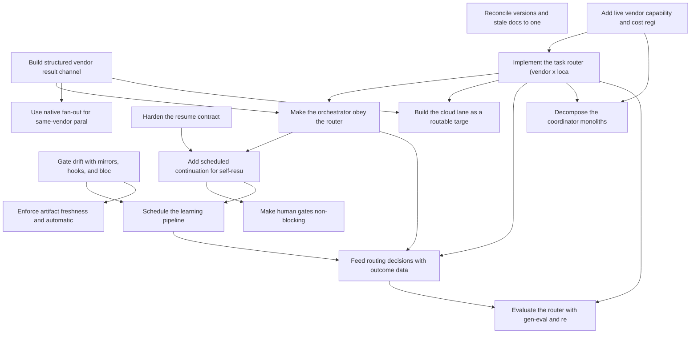

# Roadmap: repo-improvement

> Source: `docs/proposals/repo-improvement-roadmap.md` | Status: **planning** | Items: 16

<!-- GENERATED: begin phase-table -->
## Phase Table

| Priority | Item | Effort | Status | Dependencies |
|----------|------|--------|--------|--------------|
| 1 | Gate drift with mirrors, hooks, and blocking CI | M | candidate | - |
| 1 | Build structured vendor result channel | M | candidate | - |
| 1 | Add live vendor capability and cost registry | M | candidate | - |
| 1 | Implement the task router (vendor x location x model) | L | candidate | ri-04 |
| 1 | Make the orchestrator obey the router | M | candidate | ri-03, ri-05 |
| 2 | Harden the resume contract | S | candidate | - |
| 2 | Add scheduled continuation for self-resuming loops | M | candidate | ri-07, ri-06 |
| 2 | Build the cloud lane as a routable target | L | candidate | ri-03, ri-05 |
| 2 | Make human gates non-blocking | M | candidate | ri-08 |
| 3 | Reconcile versions and stale docs to one truth | S | candidate | - |
| 3 | Use native fan-out for same-vendor parallel work | M | candidate | ri-03 |
| 3 | Schedule the learning pipeline | M | candidate | ri-08, ri-01 |
| 3 | Feed routing decisions with outcome data | M | candidate | ri-05, ri-06, ri-12 |
| 3 | Enforce artifact freshness and automatic retrieval | M | candidate | ri-01 |
| 4 | Decompose the coordinator monoliths | L | candidate | ri-04, ri-05 |
| 4 | Evaluate the router with gen-eval and replay | M | candidate | ri-05, ri-13 |
<!-- GENERATED: end phase-table -->

<!-- GENERATED: begin dependency-dag -->
## Dependency Graph

<!-- GENERATED: end dependency-dag -->

<!-- GENERATED: begin item-details -->
## Item Details

### ri-01: Gate drift with mirrors, hooks, and blocking CI

- **Status**: candidate
- **Priority**: 1
- **Effort**: M

Add install.sh --check plus a CI job that fails when .claude/skills/ or .agents/skills/ drift from canonical skills/, wire core.hooksPath=.githooks into every bootstrap path, adopt or delete orphaned test suites, and promote continue-on-error CI steps (gen-eval mypy --strict blocking, Node job for apps/kanban-viz).

**Acceptance outcomes**:
- [ ] Editing a mirror file or forgetting to sync skills/ fails CI via the drift job.
- [ ] A fresh clone gets active git hooks with no manual steps.
- [ ] No test file in the repo is outside CI, and gen-eval mypy --strict is a blocking step.

### ri-03: Build structured vendor result channel

- **Status**: candidate
- **Priority**: 1
- **Effort**: M

Switch every CLI adapter to its vendor's structured JSON output mode with typed envelopes, replace stdout-regex completion polling with a coordinator completion ledger (submit_work/complete_work as the single source of dispatch state), add GET /locks?agent_id= plus bulk release to fix the cloud lock leak, and extend or explicitly document SdkVendorAdapter coverage beyond review-only.

**Acceptance outcomes**:
- [ ] No task_id_pattern or success_pattern regex remains on the primary result path for any vendor.
- [ ] A vendor CLI output-format change degrades to a loud structured error rather than a silent hang.
- [ ] Killed cloud sessions release their locks via the new list-and-release-by-agent HTTP endpoints instead of waiting out the 120-minute TTL.

### ri-04: Add live vendor capability and cost registry

- **Status**: candidate
- **Priority**: 1
- **Effort**: M

Add a coordinator vendor_registry service holding static capabilities from agents.yaml plus dynamic availability, rate-limit windows with known reset times, and a versioned real cost table replacing the policy.py stub tiers; expose GET /vendors and GET /vendors/{id}/availability, teach coordination_bridge.py the same, and delete the hardcoded vendor list in orchestrator.py.

**Acceptance outcomes**:
- [ ] evaluate_policy receives live availability and real cost deltas from the registry.
- [ ] Taking a vendor offline or hitting its limit is visible in the registry within one probe interval and changes routing output.
- [ ] No hardcoded vendor list remains in orchestrator.py; available vendors come from the registry filtered by capability.

### ri-05: Implement the task router (vendor x location x model)

- **Status**: candidate
- **Priority**: 1
- **Effort**: L
- **Depends on**: `ri-04`

Add POST /route/task and a bridge function as a superset of /archetypes/resolve_for_phase, taking a task routing profile (phase/archetype signals, duration, scope, interactivity, secret needs, parallelism, repo shape, roadmap policy) and returning vendor, location, model, isolation, dispatch_mode, and rationale, driven by deterministic unit-testable rules versioned in routing.yaml, with every decision recorded under a routing audit event type and a local static fallback table when the coordinator is down.

**Acceptance outcomes**:
- [ ] Given a synthetic task profile, POST /route/task returns a deterministic, explainable decision.
- [ ] Changing routing.yaml changes decisions with no code edits.
- [ ] Every autopilot phase dispatch logs a routing record with rationale to the audit log.

### ri-06: Make the orchestrator obey the router

- **Status**: candidate
- **Priority**: 1
- **Effort**: M
- **Depends on**: `ri-03`, `ri-05`

Call route/task before each dispatch_fn and pass the decision into the dispatch context as a contract, execute switch decisions with ledger-verified re-dispatch to the alternate vendor, add a global iteration cap and no-progress detector to the roadmap loop, un-stub _estimate_cost_delta/_estimate_wait_seconds against the registry, and turn the silent apply_phase_outcome no-op on a missing state file into an error.

**Acceptance outcomes**:
- [ ] An induced rate-limit on the preferred vendor causes an observed, ledger-verified dispatch to the alternate vendor.
- [ ] Cost and latency deltas are persisted in checkpoint.json as the roadmap-orchestration spec specifies.
- [ ] A stuck dispatch_fn trips the global iteration cap or no-progress detector instead of spinning indefinitely.

### ri-07: Harden the resume contract

- **Status**: candidate
- **Priority**: 2
- **Effort**: S

Formalize and test that any fresh session can resume a loop via /autopilot <change-id> --resume and /autopilot-roadmap <workspace> --resume with zero conversational context, adding resume-freshness checks that reconcile or escalate when the branch or checkpoint has moved.

**Acceptance outcomes**:
- [ ] A scripted kill-resume test matrix passes for every autopilot phase and roadmap orchestrator step.
- [ ] Resume after external branch movement (e.g. a human merge) reconciles or escalates instead of blindly continuing.

### ri-08: Add scheduled continuation for self-resuming loops

- **Status**: candidate
- **Priority**: 2
- **Effort**: M
- **Depends on**: `ri-07`, `ri-06`

In the Claude dispatch adapter, replace in-session async-vendor polling with self-wakeups matched to registry turnaround times and one-shot triggers at known limit-reset times; add a nightly roadmap tick and hourly PR-babysit tick that fire fresh sessions running the resume entry points; give non-Claude harnesses the same contract via cron/CI, with pause-lock guard rails, idempotent trigger registration, and deregistration at roadmap archive.

**Acceptance outcomes**:
- [ ] A roadmap started at 9am with a vendor limit hit at 10am completes overnight with zero human re-invocations.
- [ ] The audit log shows the pause, the scheduled resume, and the completion.
- [ ] Killing every live session never strands a roadmap in in_progress for more than one tick interval.

### ri-10: Build the cloud lane as a routable target

- **Status**: candidate
- **Priority**: 2
- **Effort**: L
- **Depends on**: `ri-03`, `ri-05`

Make location cloud a first-class router output - Claude cloud dispatch creates a fresh isolated session per task with a self-contained resume-contract prompt, results come back as PRs on conventional branches collected event-driven via PR activity subscriptions and the completion ledger, routing rules send independent FULL-parallel packages to cloud fan-out while secret- or Docker-dependent tasks stay local, and Codex cloud and Jules join the lane through structured harvesting.

**Acceptance outcomes**:
- [ ] /implement-feature on a 3-package FULL-parallel feature routes at least 2 packages to cloud sessions.
- [ ] All cloud results are collected as PRs without any in-session polling and integrate via the existing merge path.
- [ ] The coordinator work queue shows the full lifecycle of every cloud task.

### ri-11: Make human gates non-blocking

- **Status**: candidate
- **Priority**: 2
- **Effort**: M
- **Depends on**: `ri-08`

On ESCALATE, proposal-approval, and merge gates, write the request to the coordinator's approval queue, fire existing notification channels, mark only that item blocked, and continue with other ready items; async approval responses flip the item back to ready for the next scheduled tick, while the mandatory human merge gate stays mandatory.

**Acceptance outcomes**:
- [ ] A roadmap with one escalated item completes all independent items unattended.
- [ ] The escalated item resumes within one tick of the human's async approval.
- [ ] Time-to-unblock is visible in agent-metrics.

### ri-02: Reconcile versions and stale docs to one truth

- **Status**: candidate
- **Priority**: 3
- **Effort**: S

Single-source the root VERSION into agent-coordinator, packages/gen-eval, skills, and apps/kanban-viz, tag v0.2.0 with a minimal tag-triggered release workflow, fix documented drift (coordinator CLAUDE.md checklist, README counts, verification_gateway, formal/ duplication), and make one canonical file the sole statement of the D4 memory tag schema.

**Acceptance outcomes**:
- [ ] git tag is non-empty and a tag-triggered release workflow exists.
- [ ] One grep finds exactly one authoritative statement of the D4 memory tag schema.
- [ ] Component manifests and the /health report agree with the root VERSION file.

### ri-09: Use native fan-out for same-vendor parallel work

- **Status**: candidate
- **Priority**: 3
- **Effort**: M
- **Depends on**: `ri-03`

Run review-convergence fan-out and local-parallel work-package DAGs through native background subagents and workflow pipelines in the Claude adapter, with structured outputs schema-enforced against review-findings.schema.json at the tool-call layer, while keeping the subprocess CliVendorAdapter path for cross-vendor diversity; fix the known consensus_synthesizer.py line-range parser bug in the process.

**Acceptance outcomes**:
- [ ] A 3-vendor review round dispatches Claude reviewers natively (no subprocess, no stdout parse) and Codex/Gemini via CLI, all landing in one review-manifest.json.
- [ ] Synthesis crash recovery from .review-cache/round-N/ works end-to-end.

### ri-12: Schedule the learning pipeline

- **Status**: candidate
- **Priority**: 3
- **Effort**: M
- **Depends on**: `ri-08`, `ri-01`

Add a weekly trigger or CI cron running collect-transcripts --enable over the week's sessions followed by improve-harness, emitting a dated gap report plus coordinator issues for gaps above a frequency-times-severity threshold, and wire /prioritize-proposals to include improve-harness-generated candidates in the same queue as feature work.

**Acceptance outcomes**:
- [ ] After a week of normal operation, an unattended run produces a gap report and filed coordinator issues.
- [ ] Zero manual invocations of the collection pipeline are required.
- [ ] /prioritize-proposals output includes improve-harness-generated candidates.

### ri-13: Feed routing decisions with outcome data

- **Status**: candidate
- **Priority**: 3
- **Effort**: M
- **Depends on**: `ri-05`, `ri-06`, `ri-12`

Compile a periodic routing scorecard (success rate, convergence rounds, cost, latency, limit-hit frequency per vendor x phase-archetype x location) from routing records, the dispatch ledger, and convergence metrics; render it into routing.yaml as human-reviewed advisory weights, replace replanner.py's regex ID-matching with scorecard- and learning-driven route/task signals, and give replan_required a real handler via a scheduled /plan-roadmap --replan pass.

**Acceptance outcomes**:
- [ ] The routing scorecard exists and is regenerated on schedule.
- [ ] At least one routing rule cites scorecard evidence in its rationale.
- [ ] replan_required items are automatically re-planned or escalated within one tick, never silently stuck.

### ri-14: Enforce artifact freshness and automatic retrieval

- **Status**: candidate
- **Priority**: 3
- **Effort**: M
- **Depends on**: `ri-01`

Add staleness gates for docs/architecture-analysis/ and docs/factory-intelligence/ using their generated_at metadata and the 20-commit threshold (blocking only in skills that depend on parallel-zone data), extend the SessionStart hook to inject the latest handoff summary and top-K relevant memories, raise handoff read depth from limit=1 to recent-N, and surface phase_record.write_both() double-failures as errors at the gate.

**Acceptance outcomes**:
- [ ] No skill consumes architecture artifacts older than threshold without an explicit refresh-or-acknowledge.
- [ ] A fresh session on an in-flight change starts with the handoff summary in context with zero skill invocation.
- [ ] A failed coordinator write with a failed local fallback surfaces as an error at the gate, not a warning.

### ri-15: Decompose the coordinator monoliths

- **Status**: candidate
- **Priority**: 4
- **Effort**: L
- **Depends on**: `ri-04`, `ri-05`

Split coordination_api.py (3.3k LOC) and coordination_mcp.py (3.2k LOC) into per-domain routers and tool modules (locks, work, memory, approvals, merge-train, routing, vendors, kanban) over the existing service layer, preserving the Dockerfile-COPY contract checks.

**Acceptance outcomes**:
- [ ] No src/ module exceeds roughly 800 LOC.
- [ ] The route inventory is unchanged, verified by contract tests before and after.
- [ ] Both CI docker import guards remain green.

### ri-16: Evaluate the router with gen-eval and replay

- **Status**: candidate
- **Priority**: 4
- **Effort**: M
- **Depends on**: `ri-05`, `ri-13`

Add gen-eval scenarios asserting routing decisions and fallback ladders for synthetic task profiles and registry states (vendor down, limit hit, cost ceiling, secrets-required), plus replay evaluation that runs historical dispatch records through proposed routing.yaml changes to show decision diffs before merge.

**Acceptance outcomes**:
- [ ] Routing config changes come with a replay decision-diff in the PR.
- [ ] The gen-eval routing suite runs in CI.

<!-- GENERATED: end item-details -->

