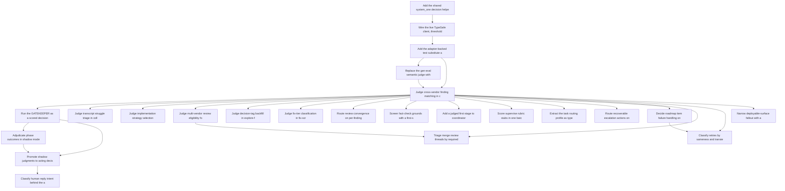

# Roadmap: roadmap-jev-system-one-integration-assessment

> Source: `docs/proposals/jev-system-one-integration-assessment.md` | Status: **planning** | Items: 24

<!-- GENERATED: begin phase-table -->
## Phase Table

| Priority | Item | Effort | Status | Dependencies |
|----------|------|--------|--------|--------------|
| 1 | Add the shared system_one decision helper, fallback-only | M | approved | - |
| 1 | Wire the live TypeSafe client, thresholds and telemetry | M | approved | ri-01 |
| 1 | Replace the gen-eval semantic judge with a calibrated Noul | M | approved | ri-03 |
| 1 | Judge cross-vendor finding matching in consensus_synthesizer | L | approved | ri-03, ri-04 |
| 1 | Run the GATEKEEPER as a scored decision in shadow mode | L | approved | ri-05 |
| 1 | Adjudicate phase outcomes in shadow mode | L | approved | ri-06 |
| 2 | Add the adapter-backed test substitute and dry-run policy | S | approved | ri-02 |
| 2 | Promote shadow judgments to acting decisions | M | approved | ri-06, ri-07 |
| 2 | Route review convergence on per-finding dispositions | L | approved | ri-05 |
| 3 | Judge transcript struggle triage in collect-transcripts | M | approved | ri-05 |
| 3 | Judge implementation strategy selection in autopilot | S | approved | ri-05 |
| 3 | Judge multi-vendor review eligibility for pull requests | M | approved | ri-05 |
| 3 | Screen fact-check grounds with a first-stage judged pass | L | approved | ri-05 |
| 3 | Add a judged first stage to coordinator audit triage | M | approved | ri-05 |
| 4 | Judge decision-tag backfill in explore-feature | S | approved | ri-05 |
| 4 | Judge fix-tier classification in fix-scrub | S | approved | ri-05 |
| 4 | Score supervise rubric stubs in one batched call | M | approved | ri-05 |
| 4 | Extract the task routing profile as typed fields | M | approved | ri-05 |
| 4 | Route recoverable escalation actions on confidence | M | approved | ri-05 |
| 4 | Decide roadmap item failure handling on confidence | M | approved | ri-05 |
| 4 | Classify retries by sameness and transience | M | approved | ri-05, ri-20 |
| 5 | Triage merge review threads by required response | M | approved | ri-05, ri-11 |
| 6 | Narrow deployable-surface fallout with a high-floor judgment | M | approved | ri-05 |
| 6 | Classify human reply intent behind the approval floor | M | approved | ri-08 |
<!-- GENERATED: end phase-table -->

<!-- GENERATED: begin dependency-dag -->
## Dependency Graph

<!-- GENERATED: end dependency-dag -->

<!-- GENERATED: begin item-details -->
## Item Details

### ri-01: Add the shared system_one decision helper, fallback-only

- **Status**: approved
- **Priority**: 1
- **Effort**: M
- **Change ID**: add-the-shared-system-one-decision-helper-fallback-only

Create the installable package packages/system-one-decisions (importable as system_one_decisions) with the frozen Decision dataclass and both entry points, decide(state, questions, *, site) and decide_intent(state, intents, *, fallback, human_intent, act_floor, irreversible, approve_floor, site), implemented with no network call at all: every decision comes from the caller's existing rule via fallback and is recorded to the caller's event log with degraded=True and evidence_class "judgment". Declare it from every consuming runtime: a path dependency in skills/pyproject.toml, an optional "decisions" extra in packages/gen-eval/pyproject.toml, and a path dependency in agent-coordinator/pyproject.toml plus a COPY line in the coordinator Dockerfile beside the existing gen-eval and code-search copies.

**Acceptance outcomes**:
- [ ] packages/system-one-decisions exports Decision(intent, p, distribution, degraded, evidence_class="judgment"), decide and decide_intent, has no required dependencies, and imports no vendor SDK.
- [ ] The package is importable from the skills venv, from a standalone `uv pip install packages/gen-eval[decisions]`, and inside the coordinator Docker image (docker-smoke-import covers `import system_one_decisions`).
- [ ] With no TYPESAFE_API_KEY set, decide_intent returns fallback(state) with degraded=True and never raises, proven by a unit test for each of the four documented checks (unavailable, act_floor, irreversible/approve_floor, normal return).
- [ ] A decide_intent call appends one event carrying intent, distribution and degraded to the caller's event log, asserted against a loop-state.json phase_history fixture.
- [ ] Unit tests in packages/system-one-decisions/tests cover act_floor routing to human_intent and needs_approval flagging for intents in the irreversible set.

### ri-02: Wire the live TypeSafe client, thresholds and telemetry

- **Status**: approved
- **Priority**: 1
- **Effort**: M
- **Change ID**: wire-the-live-typesafe-client-thresholds-and-telemetry
- **Depends on**: `ri-01`

Add typesafe-sdk under a "live" optional extra of packages/system-one-decisions, have the package build the live client from TYPESAFE_API_KEY behind a token-budget guard, and record site, latency, usage.input_tokens and the answered probabilities to the existing Langfuse hook. Establish the per-site threshold convention: thresholds live in architecture.config.yaml or the skill's own config beside the rule they replace, never as literals in a scoring module.

**Acceptance outcomes**:
- [ ] packages/system-one-decisions declares a "live" extra containing typesafe-sdk; the default install of the package and of every consumer still succeeds without it.
- [ ] typesafe_sdk is imported inside packages/system-one-decisions and nowhere else in the repository, enforced by a grep-style guard test.
- [ ] decide returns None (never raises) when the key is absent, the network fails, or serialized state plus the longest question exceeds the 32K-token budget, with one test per branch.
- [ ] Each completed call emits one Langfuse record carrying site, latency_ms, usage.input_tokens and the per-label probabilities.
- [ ] A guard test asserts no float threshold literal is introduced into the package; defaults resolve from architecture.config.yaml.

### ri-04: Replace the gen-eval semantic judge with a calibrated Noul

- **Status**: approved
- **Priority**: 1
- **Effort**: M
- **Change ID**: replace-the-gen-eval-semantic-judge-with-a-calibrated-noul
- **Depends on**: `ri-03`

Rewrite gen_eval.semantic_judge.evaluate_semantic to ask one Noul("The actual output satisfies the criteria") over {criteria, actual_output}, using noul as the confidence that min_confidence already thresholds, and call the existing LLM prompt only on failures that need a human-readable reasoning string.

**Acceptance outcomes**:
- [ ] evaluate_semantic scores the 40-item human-labelled set from calibrate-llm-judge-against-human-labels and reaches Cohen's kappa >= 0.7 on the judged dimension; the measured kappa is recorded in the change's artifacts.
- [ ] min_confidence gates on noul with no signature change, and existing semantic_judge tests pass unmodified.
- [ ] When the decision helper returns None the module still returns its existing skip result, covered by a test.
- [ ] Reasoning prose is produced by an LLM only for items that fail the threshold, asserted by a test counting LLM invocations on an all-pass batch (zero).

### ri-05: Judge cross-vendor finding matching in consensus_synthesizer

- **Status**: approved
- **Priority**: 1
- **Effort**: L
- **Change ID**: judge-cross-vendor-finding-matching-in-consensus-synthesizer
- **Depends on**: `ri-03`, `ri-04`

Add a judged path to consensus_synthesizer.match_score: for candidate pairs sharing axis and file, ask one Noul("Findings A and B describe the same underlying defect") per pair, batched as N questions over one shared per-file state, keeping the line-overlap and snippet bands as fast paths and the Jaccard bands as the fallback. A match established only by the judged path records match_basis "judged", and _consensus_evidence_class returns "judgment" for any consensus finding whose match basis is judged regardless of its contributors' classes, so a probabilistic match can never raise the blocking count; its output feeds adjudication and disagreement routing. Move MATCH_THRESHOLD into config.

**Acceptance outcomes**:
- [ ] Replaying openspec/changes/add-orchestrator-adjudication-review-gate/fixtures/pr484-consensus.json pairs the two real defects across vendors and routes them to adjudication rather than leaving them unconfirmed.
- [ ] A consensus finding whose match basis is judged carries evidence_class "judgment" even when both contributing findings are deterministic, and blocking_count is unchanged by judged matches, asserted by a unit test on two deterministic scanner findings.
- [ ] Routing precision on the seeded-defect set from measure-validator-recall-seeded-defects does not drop relative to the recorded band-only baseline, with both numbers in the change artifacts.
- [ ] Pairs resolved by the line-overlap or identical-snippet fast paths issue no call, asserted by a call-count test.
- [ ] MATCH_THRESHOLD is read from config by both consensus_synthesizer.py and review_ledger.py; no threshold float literal remains in the scoring path.

### ri-06: Run the GATEKEEPER as a scored decision in shadow mode

- **Status**: approved
- **Priority**: 1
- **Effort**: L
- **Change ID**: run-the-gatekeeper-as-a-scored-decision-in-shadow-mode
- **Depends on**: `ri-05`

Add shadow-mode recording to the autopilot loop and use it for _phase_gatekeeper: alongside the existing premium-tier judge, ask Score(verifiability, 4 levels), Score(risk, 4 levels) and Choice(verdict, {proceed, proceed_with_review, escalate}) over gate_signals plus proposal.md, tasks.md and the work-packages summary, compute a candidate verdict in code from the two scores, and log it beside the acting verdict without acting on it.

**Acceptance outcomes**:
- [ ] A shadow record per gatekeeper run appends judged verdict, both score distributions and the acting verdict to loop-state.json phase_history, asserted against a fixture run.
- [ ] The acting verdict is byte-identical to today's for every run in the shadow period, proven by a replay test over recorded gate_signals.
- [ ] The code-computed verdict is derived from the two Score distributions with thresholds read from config; the Choice verdict is recorded only as a cross-check.
- [ ] A reporting script emits the GATEKEEPER disagreement rate over the shadow period's runs.
- [ ] --force and the scope-safety floor are untouched, covered by existing autopilot tests passing unmodified.

### ri-07: Adjudicate phase outcomes in shadow mode

- **Status**: approved
- **Priority**: 1
- **Effort**: L
- **Change ID**: adjudicate-phase-outcomes-in-shadow-mode
- **Depends on**: `ri-06`

Insert a decision step between a phase sub-agent's return and apply_phase_outcome that asks Choice(outcome, the phase's allowed outcomes) and Noul("the evidence supports the claimed outcome") over the handoff record, expected_outcomes, worktree diff stat, test-output tail and the claimed outcome, recording judged versus claimed without changing the reducer.

**Acceptance outcomes**:
- [ ] Each phase transition appends a record with claimed outcome, judged outcome, the outcome distribution and the evidence Noul to loop-state.json phase_history.
- [ ] transition(state, outcome) still runs on the claimed outcome for the whole shadow period, proven by a replay test showing identical phase sequences.
- [ ] The disagreement report attributes each disagreement to the side the next review round vindicated, over at least one sprint of recorded autopilot runs.
- [ ] A degraded decision (helper returns None) is recorded via record_degraded and leaves the existing behaviour unchanged, covered by a test.

### ri-03: Add the adapter-backed test substitute and dry-run policy

- **Status**: approved
- **Priority**: 2
- **Effort**: S
- **Change ID**: add-the-adapter-backed-test-substitute-and-dry-run-policy
- **Depends on**: `ri-02`

Stand up the testing convention for every later site: unit tests stub decide/decide_intent, behavioural wiring tests use system-one-adapter (Anthropic provider, llm_answer_mode="probabilities") with test names marking its probabilities uncalibrated, and --dry-run paths make no API call.

**Acceptance outcomes**:
- [ ] A reusable pytest fixture stubs decide/decide_intent and is exercised by at least one test that asserts the caller's fallback rule still runs when the stub returns None.
- [ ] Adapter-backed behavioural tests are skipped by default, run only when the adapter env is present, and every such test name contains "uncalibrated".
- [ ] A test asserts that running any system_one-consuming script with --dry-run performs zero client constructions.

### ri-08: Promote shadow judgments to acting decisions

- **Status**: approved
- **Priority**: 2
- **Effort**: M
- **Change ID**: promote-shadow-judgments-to-acting-decisions
- **Depends on**: `ri-06`, `ri-07`

Using the shadow-period measurements, flip both sites to act: the gate outcome is computed from the calibrated scores with operator-set thresholds, and phase-outcome adjudication applies the switch rule (agreement above act_floor proceeds; disagreement lets the judged label win above approve_floor, otherwise escalate with both labels in the evidence). Retire the premium-tier gatekeeper dispatch.

**Acceptance outcomes**:
- [ ] Promotion is gated on the recorded shadow disagreement rate and vindication split, both cited in the change's rationale with the thresholds chosen from them.
- [ ] A test asserts that claimed/judged disagreement below approve_floor transitions to escalate with both labels present in the escalation evidence.
- [ ] The premium-tier GATEKEEPER archetype dispatch is removed from the autopilot run path and complexity_gate.default_gate_verdict remains the headless fallback, covered by a headless-run test.
- [ ] Per-run judged-call cost for a reference autopilot run is recorded and is under one cent.
- [ ] Every promoted decision reaching a report carries evidence_class "judgment" and its probability; no deterministic gate is bypassed, asserted by the scope-safety floor tests.

### ri-14: Route review convergence on per-finding dispositions

- **Status**: approved
- **Priority**: 2
- **Effort**: L
- **Change ID**: route-review-convergence-on-per-finding-dispositions
- **Depends on**: `ri-05`

In convergence_loop.converge, ask a round-level Noul("another fix round is likely to reduce blocking findings") and, per blocking finding, Choice(disposition, {fix_now, defer_to_followup, reject_out_of_scope, needs_human}) over the ledger trend, the last fix diff and each item's mark_addressed / reject_out_of_scope_fix history. Route fix_now to fix_callback, defer and reject through the existing ledger calls, and park needs_human.

**Acceptance outcomes**:
- [ ] max_rounds remains a hard ceiling that no judged answer can extend, asserted by a test where the round Noul stays high.
- [ ] A replay over recorded ledger trends shows fewer fix dispatches than the stall rule for the same terminal blocking count, with both counts recorded.
- [ ] defer_to_followup and reject_out_of_scope go through the existing park_item and reject_out_of_scope_fix paths, with no new ledger mutation surface.
- [ ] needs_human parks the item as a disagreement rather than dispatching a fix, covered by a test.
- [ ] With the helper returning None the stall rule trend[-1] >= trend[-stall_window] still governs, proven by existing convergence tests passing unchanged.

### ri-09: Judge transcript struggle triage in collect-transcripts

- **Status**: approved
- **Priority**: 3
- **Effort**: M
- **Change ID**: judge-transcript-struggle-triage-in-collect-transcripts
- **Depends on**: `ri-05`

Keep the four event-stream counters in triage.py as facts but replace the weighted sum and its 5/10 buckets with Choice(struggle_level, {none, low, medium, high}) plus Nouls for human redirection, out-of-scope work and whether the session warrants deep analysis, over a compacted transcript from normalize.py plus the counters.

**Acceptance outcomes**:
- [ ] flagged_for_deep_analysis is set from the corresponding Noul with a config-held threshold; the weighted sum and its 5/10 buckets remain as the fallback and are exercised by a test.
- [ ] State sent for triage contains only assistant/user/tool-result text from normalize.py's compact event form, with a test asserting tool payloads are excluded and the state stays under the token budget.
- [ ] The four counters are still computed deterministically and appear unchanged in the triage output schema.
- [ ] Existing collect-transcripts triage tests pass with the helper stubbed to None.

### ri-10: Judge implementation strategy selection in autopilot

- **Status**: approved
- **Priority**: 3
- **Effort**: S
- **Change ID**: judge-implementation-strategy-selection-in-autopilot
- **Depends on**: `ri-05`

Replace the four-criterion weighted sum in implementation_strategy_selector with Choice(strategy, {alternatives, lead_review}) over the package YAML and the matching design.md section, using the reserved design_path parameter, while keeping the vendor-count availability gate deterministic and falling back to lead_review when confidence is low.

**Acceptance outcomes**:
- [ ] design_path is read and its matching design.md section forms part of the state, covered by a test using a package fixture.
- [ ] Confidence below the config-held floor yields lead_review, asserted by a stubbed-decision test.
- [ ] The vendor-count gate still forces lead_review when fewer than three vendors are available, regardless of the judged label.
- [ ] The existing weighted-sum selector remains reachable as the fallback and its current tests pass unchanged.

### ri-11: Judge multi-vendor review eligibility for pull requests

- **Status**: approved
- **Priority**: 3
- **Effort**: M
- **Change ID**: judge-multi-vendor-review-eligibility-for-pull-requests
- **Depends on**: `ri-05`

Replace the under-50-lines / under-3-files skip in vendor_review.check_review_eligibility with Noul("This PR warrants independent multi-vendor review") and Score(risk, ["docs/config only", "internal refactor", "behaviour change", "security or data path"]) over the PR title, body, file list and diff stat, keeping the size rule as the degraded path.

**Acceptance outcomes**:
- [ ] A fixture PR of under 50 changed lines touching guardrails.py or a policy file is routed to multi-vendor review; a docs-only PR of over 300 lines is not.
- [ ] The dependabot/renovate/Jules-subtype origin skip list still short-circuits before any decision call, asserted by a call-count test.
- [ ] SMALL_PR_MAX_CHANGED_LINES and SMALL_PR_MAX_FILES move to config and remain the fallback when the helper returns None.
- [ ] The eligibility record in the merge report carries evidence_class "judgment", the risk score and its probability.

### ri-15: Screen fact-check grounds with a first-stage judged pass

- **Status**: approved
- **Priority**: 3
- **Effort**: L
- **Change ID**: screen-fact-check-grounds-with-a-first-stage-judged-pass
- **Depends on**: `ri-05`

Split fact_check.run into two stages: stage one asks one Noul per finding for Ground A ("the code the finding describes is not in the subject file's diff") and one Noul("a line in this diff directly contradicts the finding's central claim") as a Ground-B screen; stage two runs the existing economy-tier LLM prompt only for findings whose Ground-B probability crosses a config-held threshold.

**Acceptance outcomes**:
- [ ] A batch whose findings all screen below the Ground-B threshold makes zero stage-two LLM calls, asserted by a call-count test.
- [ ] Ground-B verdicts still require a quoted diff line validated by _evidence_line_in_subject_diff; no finding is refuted on the screen alone, covered by a test.
- [ ] Protected-subject vetoes are applied in code before any call, asserted by a fixture where a protected subject is never sent.
- [ ] Ground-A refutations from stage one reproduce the existing prompt's labels on a recorded fact-check batch, with the agreement rate recorded.

### ri-16: Add a judged first stage to coordinator audit triage

- **Status**: approved
- **Priority**: 3
- **Effort**: M
- **Change ID**: add-a-judged-first-stage-to-coordinator-audit-triage
- **Depends on**: `ri-05`

In audit_triage.drain_and_classify, ask per session batch Noul("This session shows a capability gap in the harness"), Choice(failure_type, the six enum values plus none) and Score(severity, [low, medium, high, critical]); run the current LLM prompt only for sessions above the recall-oriented threshold, seeded with the stage-one labels so its output is constrained.

**Acceptance outcomes**:
- [ ] The recall-oriented threshold lives in config and a replay over recorded audit batches shows recall no lower than the current prompt's, with both numbers recorded.
- [ ] Sessions below the threshold produce no LLM call, asserted by a call-count test over a clean-session fixture.
- [ ] Stage-two findings are seeded with the stage-one failure_type and severity and still pass validate_finding unchanged.
- [ ] The hot-path ring buffer write path is unmodified and its latency test is unchanged.

### ri-12: Judge decision-tag backfill in explore-feature

- **Status**: approved
- **Priority**: 4
- **Effort**: S
- **Change ID**: judge-decision-tag-backfill-in-explore-feature
- **Depends on**: `ri-05`

Replace the seven keyword lists in backfill_decision_tags with Choice(capability, the seven capability tags plus "none") over each decision's title and rationale, batched as many questions over one session-log phase as shared state, and feed ChoiceAnswer.probabilities into the existing 0.5/0.8 confidence buckets.

**Acceptance outcomes**:
- [ ] The report's confidence field is populated from ChoiceAnswer.probabilities and the existing 0.5/0.8 bucketing code is unchanged, asserted by a test over a session-log fixture.
- [ ] A decision matching no capability yields the "none" option and is excluded from proposed edits.
- [ ] All decisions in one session-log phase are answered in a single batched call, asserted by a call-count test.
- [ ] The keyword map remains as the fallback and the script still only proposes edits for agent review; no file is written by the script itself.

### ri-13: Judge fix-tier classification in fix-scrub

- **Status**: approved
- **Priority**: 4
- **Effort**: S
- **Change ID**: judge-fix-tier-classification-in-fix-scrub
- **Depends on**: `ri-05`

Replace the two string tests in fix_scrub.classify with Noul("An agent could act on this marker without asking a human") and Noul("This finding includes a concrete, applicable fix"), keeping _is_ruff_fixable and source-based routing deterministic.

**Acceptance outcomes**:
- [ ] A ten-word TODO with no actionable content lands in the ask-a-human tier and a terse but actionable one does not, covered by fixtures in skills/tests/fix-scrub.
- [ ] _is_ruff_fixable still classifies by ruff rule prefix with no decision call, asserted by a call-count test.
- [ ] The character-count and substring rules remain the fallback and existing classify tests pass with the helper stubbed to None.

### ri-17: Score supervise rubric stubs in one batched call

- **Status**: approved
- **Priority**: 4
- **Effort**: M
- **Change ID**: score-supervise-rubric-stubs-in-one-batched-call
- **Depends on**: `ri-05`

Replace the analyst-archetype rubric dispatch with up to 100 Score questions over one manifest state (five factors for up to 20 stubs) in a single call, and resolve the justification blocker by relaxing justification to optional in the rubric-score contract so the digest renders the Score legend level instead.

**Acceptance outcomes**:
- [ ] The rubric-score contract marks justification optional and the digest renders the Score legend level when it is absent, covered by a digest snapshot test.
- [ ] Twenty stubs are scored on five factors in one call and the result validates against the updated schema, asserted over a manifest fixture.
- [ ] Structural-error handling (missing, partial, invalid, late) is exercised by a test showing the analyst-archetype dispatch remains the fallback.
- [ ] Scores over a recorded manifest agree with the archived analyst output above a recorded agreement rate, cited in the change artifacts.

### ri-18: Extract the task routing profile as typed fields

- **Status**: approved
- **Priority**: 4
- **Effort**: M
- **Change ID**: extract-the-task-routing-profile-as-typed-fields
- **Depends on**: `ri-05`

Produce the task router's routing profile from a task description with Score(duration, [minutes, an hour, a day, longer]), Noul("needs interactive human input"), Noul("needs a secret or credential") and Choice(scope, {single_file, package, cross_package, repo_wide}), leaving the routing rules themselves deterministic and versioned.

**Acceptance outcomes**:
- [ ] The router consumes only typed profile fields and its rule evaluation is unchanged, asserted by routing tests that pass a hand-written profile.
- [ ] The routing audit event carries the probabilities for every profile field it was given.
- [ ] With the helper returning None the router still resolves using its declared or default profile, covered by a test.
- [ ] A fixture set of task descriptions yields the expected profile fields, with duration and scope agreement recorded.

### ri-19: Route recoverable escalation actions on confidence

- **Status**: approved
- **Priority**: 4
- **Effort**: M
- **Change ID**: route-recoverable-escalation-actions-on-confidence
- **Depends on**: `ri-05`

In EscalationHandler.handle, ask Choice(action, the EscalationAction values) over the escalation summary, impact set and attempt history, restricted to the recoverable actions for escalation types the existing table already treats as recoverable, with the prescribed mapping as the fallback.

**Acceptance outcomes**:
- [ ] Escalation types whose table entry is REQUIRE_HUMAN always return REQUIRE_HUMAN regardless of the distribution, asserted per type by a parametrised test.
- [ ] The candidate action set passed for each type is a subset of that type's table-permitted recoverable actions, asserted by a test over every escalation type.
- [ ] Below act_floor the handler routes to the human intent rather than the fallback action, covered by a test.
- [ ] Every handled escalation records the chosen action, its distribution and degraded flag in the escalation record.

### ri-20: Decide roadmap item failure handling on confidence

- **Status**: approved
- **Priority**: 4
- **Effort**: M
- **Change ID**: decide-roadmap-item-failure-handling-on-confidence
- **Depends on**: `ri-05`

Replace the replan boolean derived from _normalize_outcome in orchestrator._handle_failure with Choice(next, {retry_same_vendor, retry_other_vendor, skip_item, request_replan, escalate}) over the failure reason, the item's acceptance outcomes and the attempt history.

**Acceptance outcomes**:
- [ ] request_replan still traverses the REPLAN_REQUIRED gate unchanged, asserted by an existing gate test passing unmodified.
- [ ] Each decision and its distribution are appended to the roadmap checkpoint's event log.
- [ ] The attempt-count ceiling still terminates retries regardless of the chosen label, covered by a test.
- [ ] With the helper returning None, _normalize_outcome's replan boolean governs and current orchestrator failure tests pass unchanged.

### ri-22: Classify retries by sameness and transience

- **Status**: approved
- **Priority**: 4
- **Effort**: M
- **Change ID**: classify-retries-by-sameness-and-transience
- **Depends on**: `ri-05`, `ri-20`

In phase_fixer and the roadmap dispatcher, replace the consecutive-failure count as the sole retry signal with Noul("this error is the same failure as the previous attempt"), Noul("this error is transient and retrying without change is likely to succeed") and Choice(failure_type, the existing failure-type enum), stopping early when a failure is the same and not transient.

**Acceptance outcomes**:
- [ ] A same-and-not-transient failure stops retrying before the ceiling, asserted by a test that counts attempts against the current count-only baseline.
- [ ] The retry ceiling is unchanged and still terminates, covered by a test where both Nouls are inconclusive.
- [ ] The emitted failure_type uses the existing enum values consumed by improve-harness, validated against that consumer's schema.
- [ ] With the helper returning None the consecutive-failure count governs and existing phase_fixer retry tests pass unchanged.

### ri-21: Triage merge review threads by required response

- **Status**: approved
- **Priority**: 5
- **Effort**: M
- **Change ID**: triage-merge-review-threads-by-required-response
- **Depends on**: `ri-05`, `ri-11`

In execute_plan's delegate_comments, classify each unresolved review thread with Choice({needs_code_change, needs_reply_only, already_addressed, outdated}) over the thread text and the current diff of the file it points at, delegating only needs_code_change.

**Acceptance outcomes**:
- [ ] A thread whose concern is visibly resolved in the current file diff is classified already_addressed and triggers no delegation, covered by a fixture in the execute_plan tests.
- [ ] staleness_gate, security_gate and live_state_gate run before any decision call and their outcomes are unaffected, asserted by a call-ordering test.
- [ ] Threads below act_floor fall through to delegation rather than being silently closed.
- [ ] With the helper returning None every unresolved thread is delegated exactly as today, proven by existing execute_plan tests.

### ri-23: Narrow deployable-surface fallout with a high-floor judgment

- **Status**: approved
- **Priority**: 6
- **Effort**: M
- **Change ID**: narrow-deployable-surface-fallout-with-a-high-floor-judgment
- **Depends on**: `ri-05`

For the unknown bucket only in gate_logic.classify_deployable_surface, ask Noul("This change alters the behaviour of a running service") and accept non-deployable only when that probability is at or below a low config-held ceiling (about 0.1); any higher probability keeps failing closed to deployable. Declared frontmatter and the proven-non-deployable prefix set stay authoritative.

**Acceptance outcomes**:
- [ ] Changes with declared frontmatter or a prefix in the proven-non-deployable set never reach a decision call, asserted by a call-count test.
- [ ] A probability of altering a running service above the configured ceiling still yields deployable (fail closed), covered by a parametrised test around the ceiling including a high-probability case that must remain deployable.
- [ ] Every judged classification writes DEGRADED-style provenance ("derived by system_one, p(alters service)=0.04") into the validation report via record_degraded-equivalent plumbing, asserted on a report fixture.
- [ ] A replay over recorded unknown-bucket changes shows no change previously classified deployable being downgraded unless its probability of altering a service is at or below the ceiling.

### ri-24: Classify human reply intent behind the approval floor

- **Status**: approved
- **Priority**: 6
- **Effort**: M
- **Change ID**: classify-human-reply-intent-behind-the-approval-floor
- **Depends on**: `ri-08`

Replace relay.parse_reply's first-word keyword match with Choice({approve, deny, resolved, skip, guidance}) over the reply text, keeping the sender allowlist, requiring distribution["approve"] >= 0.97 for an approval and mapping everything else to guidance.

**Acceptance outcomes**:
- [ ] Replies from senders outside the allowlist are rejected before any decision call, asserted by a call-count test.
- [ ] approve is returned only when distribution["approve"] >= 0.97; every other case, including a degraded decision, returns guidance, covered by a parametrised test around 0.97.
- [ ] A corpus of recorded replies shows no reply currently classified non-approve becoming approve without meeting the floor.
- [ ] The change carries a security review recording the trust-model impact, and every classified reply logs its distribution alongside the sender.

<!-- GENERATED: end item-details -->

