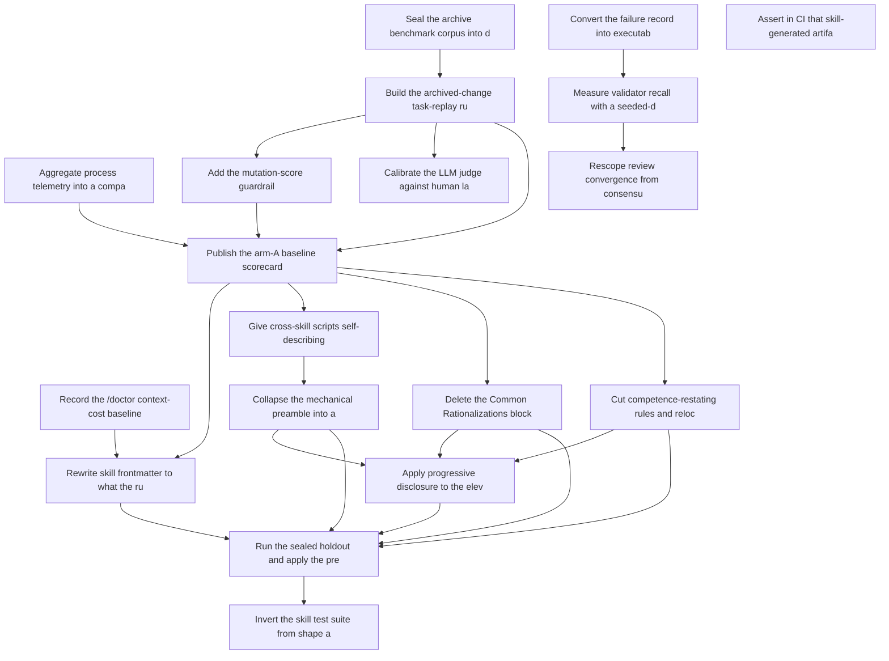

# Roadmap: skill-rightsizing

> Source: `docs/proposals/skill-rightsizing-roadmap.md` | Status: **planning** | Items: 19

<!-- GENERATED: begin phase-table -->
## Phase Table

| Priority | Item | Effort | Status | Dependencies |
|----------|------|--------|--------|--------------|
| 1 | Convert the failure record into executable regression scenarios | L | candidate | - |
| 1 | Seal the archive benchmark corpus into development and holdout partitions | S | candidate | - |
| 1 | Build the archived-change task-replay runner | L | candidate | ri-02 |
| 1 | Publish the arm-A baseline scorecard | M | candidate | ri-03, ri-05, ri-07 |
| 1 | Rewrite skill frontmatter to what the runtime reads | M | candidate | ri-04, ri-09 |
| 1 | Give cross-skill scripts self-describing CLI interfaces | L | candidate | ri-09 |
| 1 | Collapse the mechanical preamble into a session-start tool | L | candidate | ri-11 |
| 1 | Run the sealed holdout and apply the pre-registered decision rule | M | candidate | ri-10, ri-12, ri-13, ri-14, ri-15 |
| 1 | Assert in CI that skill-generated artifacts pass their own validators | S | candidate | - |
| 2 | Aggregate process telemetry into a comparable scorecard feed | M | candidate | - |
| 2 | Record the /doctor context-cost baseline | S | candidate | - |
| 2 | Measure validator recall with a seeded-defect harness | L | candidate | ri-01 |
| 2 | Add the mutation-score guardrail | M | candidate | ri-05 |
| 2 | Delete the Common Rationalizations block and relax the tail-block invariants | M | candidate | ri-09 |
| 2 | Cut competence-restating rules and relocate genuine project policy | M | candidate | ri-09 |
| 2 | Apply progressive disclosure to the eleven oversized skills | L | candidate | ri-12, ri-13, ri-14 |
| 2 | Rescope review convergence from consensus to disagreement routing | M | candidate | ri-06 |
| 2 | Invert the skill test suite from shape assertions to behavioural scenarios | M | candidate | ri-17 |
| 3 | Calibrate the LLM judge against human labels | M | candidate | ri-05 |
<!-- GENERATED: end phase-table -->

<!-- GENERATED: begin dependency-dag -->
## Dependency Graph

<!-- GENERATED: end dependency-dag -->

<!-- GENERATED: begin item-details -->
## Item Details

### ri-01: Convert the failure record into executable regression scenarios

- **Status**: candidate
- **Priority**: 1
- **Effort**: L
- **Change ID**: convert-failure-record-to-regression-scenarios

Turn the Observations and Follow-ups sections of the 18 files in docs/merge-logs/ and the entries in docs/lessons-learned.md into runnable regression scenarios under the gen-eval scenario format, each tagged with the defect category it represents.

**Acceptance outcomes**:
- [ ] Every Observation and Follow-up in docs/merge-logs/ is either converted to a scenario or explicitly marked not-reproducible with a reason.
- [ ] The scenario suite runs from a single command and reports pass/fail per scenario.
- [ ] Each scenario carries a defect-category tag drawn from a documented closed vocabulary.
- [ ] At least one converted scenario fails against the current codebase, proving the suite has teeth rather than encoding only already-fixed behaviour.

### ri-02: Seal the archive benchmark corpus into development and holdout partitions

- **Status**: candidate
- **Priority**: 1
- **Effort**: S
- **Change ID**: seal-archive-benchmark-corpus-split

Partition the 92 archived OpenSpec changes into a 60-change development split and a 32-change sealed holdout, recorded in a committed manifest with a checksum, and biased so the holdout draws from the most recent changes.

**Acceptance outcomes**:
- [ ] A committed manifest assigns all 92 archived changes to exactly one partition.
- [ ] The manifest records a checksum that detects post-hoc reassignment.
- [ ] Tooling refuses to run holdout tasks unless explicitly invoked with a decision-run flag.
- [ ] The holdout partition is drawn predominantly from changes archived after 2026-05-01.

### ri-05: Build the archived-change task-replay runner

- **Status**: candidate
- **Priority**: 1
- **Effort**: L
- **Change ID**: build-task-replay-runner
- **Depends on**: `ri-02`

Build a runner that restores the repository to a change's pre-implementation commit, hands the agent that change's proposal.md as intent while withholding the implementation, and scores the produced diff against the change's own Given/When/Then scenarios and tests.

**Acceptance outcomes**:
- [ ] The runner replays any development-split change end to end and emits a per-scenario pass/fail result.
- [ ] Replay is validated on 10 changes before the corpus is scaled to 30.
- [ ] The agent under replay has no filesystem access to the withheld implementation diff.
- [ ] Each task runs N=3 times per arm and the runner reports variance across runs.

### ri-09: Publish the arm-A baseline scorecard

- **Status**: candidate
- **Priority**: 1
- **Effort**: M
- **Change ID**: publish-arm-a-baseline-scorecard
- **Depends on**: `ri-03`, `ri-05`, `ri-07`

Run the current skills across the development split and publish the baseline scorecard covering acceptance pass rate, SHALL/MUST clause coverage, mutation score and process telemetry, with the accept/reject rule pre-registered before any cut lands.

**Acceptance outcomes**:
- [ ] A committed scorecard reports every metric for the current skills across the development split.
- [ ] The accept/reject rule is recorded before any rightsizing change is merged.
- [ ] Run-to-run variance is reported per metric so later deltas can be read against noise.

### ri-10: Rewrite skill frontmatter to what the runtime reads

- **Status**: candidate
- **Priority**: 1
- **Effort**: M
- **Change ID**: rewrite-skill-frontmatter
- **Depends on**: `ri-04`, `ri-09`

Delete the dead triggers field from all 52 skills that carry it, audit category and tags for any real consumer, and rewrite all 74 descriptions to state both what the skill does and when to use it.

**Acceptance outcomes**:
- [ ] No SKILL.md contains a triggers field.
- [ ] All 74 descriptions state both capability and trigger condition in third person.
- [ ] The /doctor listing context cost is re-measured and compared against the ri-04 baseline.
- [ ] Skill-selection accuracy on a held-out set of natural user phrasings does not regress.

### ri-11: Give cross-skill scripts self-describing CLI interfaces

- **Status**: candidate
- **Priority**: 1
- **Effort**: L
- **Change ID**: add-self-describing-cli-entry-points
- **Depends on**: `ri-09`

Add console entry points in skills/pyproject.toml for the shared scripts, so every cross-skill call becomes a named command that accepts --json, exits non-zero with an actionable message, and documents itself through --help.

**Acceptance outcomes**:
- [ ] No SKILL.md contains a <skill-base-dir> placeholder or a sys.path.insert line.
- [ ] Every shared command supports --json and --help.
- [ ] Failure paths exit non-zero with a message naming the corrective action.
- [ ] The "run it BARE — do not pipe" warning class is removed because exit status is no longer ambiguous.

### ri-12: Collapse the mechanical preamble into a session-start tool

- **Status**: candidate
- **Priority**: 1
- **Effort**: L
- **Change ID**: collapse-mechanical-preamble-session-start
- **Depends on**: `ri-11`

Replace the coordinator detection, tier selection, worktree setup, parent-branch resolution and worker-vendor recording steps with a single command returning structured state, and reduce the corresponding prose in all seven skills that carry it.

**Acceptance outcomes**:
- [ ] One command returns tier, tier rationale, worktree path, worktree branch, feature branch and worker vendor as JSON.
- [ ] Tier-selection logic exists in exactly one place and is unit tested.
- [ ] The seven affected skills no longer restate coordinator detection or tier selection.
- [ ] Replay results for the affected skills are non-inferior to the ri-09 baseline.

### ri-17: Run the sealed holdout and apply the pre-registered decision rule

- **Status**: candidate
- **Priority**: 1
- **Effort**: M
- **Change ID**: run-sealed-holdout-decision
- **Depends on**: `ri-10`, `ri-12`, `ri-13`, `ri-14`, `ri-15`

Unseal the 32-change holdout partition, run both arms across it, and accept or reject the rightsizing work against the rule registered in ri-09.

**Acceptance outcomes**:
- [ ] Both arms run across all 32 holdout changes at N=3 with blinded judging.
- [ ] The accept/reject verdict is stated against the rule as registered, without amendment.
- [ ] Per-metric deltas are published with variance, and any rejected cut is reverted or reworked rather than retained.

### ri-19: Assert in CI that skill-generated artifacts pass their own validators

- **Status**: candidate
- **Priority**: 1
- **Effort**: S
- **Change ID**: assert-generated-artifacts-validate-in-ci

For every skill that emits a structured artifact — OpenSpec change directories, roadmap.yaml, spec deltas, work-packages.yaml — add a test that generates the artifact and runs the real validator against it, wired into CI.

**Acceptance outcomes**:
- [ ] Every artifact-generating skill has a test that runs its artifact through the real validator, not a structural approximation.
- [ ] Reverting the per-item scaffolder fix makes that test fail.
- [ ] The checks run in CI on every push and block merge on failure.
- [ ] Each generator documents which validator is authoritative for its output.

### ri-03: Aggregate process telemetry into a comparable scorecard feed

- **Status**: candidate
- **Priority**: 2
- **Effort**: M
- **Change ID**: aggregate-process-telemetry-scorecard

Extract turns, tool calls, tokens, retries, ESCALATE transitions, rework-report entries and time-to-green from the existing langfuse, collect-transcripts, session-log and loop-state.json sources into a single per-run record suitable for arm comparison.

**Acceptance outcomes**:
- [ ] A single command emits one JSON record per agent run with all named metrics populated.
- [ ] Records from at least two different vendor harnesses normalize to the same schema.
- [ ] The feed backfills from existing stored transcripts, not only from new runs.

### ri-04: Record the /doctor context-cost baseline

- **Status**: candidate
- **Priority**: 2
- **Effort**: S
- **Change ID**: record-doctor-context-cost-baseline

Run the /doctor setup checkup against the repository and commit its findings as a dated baseline — the always-loaded skill-listing context cost, its biggest contributors, the unused-skill list, and any slow SessionStart hooks.

**Acceptance outcomes**:
- [ ] A committed dated report states the total skill-listing context cost and names its top contributors.
- [ ] Skills never triggered in the available transcript history are listed as deletion candidates.
- [ ] Any SessionStart hook flagged as slow is recorded with its measured duration.

### ri-06: Measure validator recall with a seeded-defect harness

- **Status**: candidate
- **Priority**: 2
- **Effort**: L
- **Change ID**: measure-validator-recall-seeded-defects
- **Depends on**: `ri-01`

Inject 40 known defects drawn from the categories established in ri-01, run each review skill against them, and report per-skill recall.

**Acceptance outcomes**:
- [ ] Each review skill reports a recall figure against the 40-defect set.
- [ ] Defect categories are traceable to real observations from the failure record.
- [ ] Seeded defects are injected reproducibly from a committed manifest.
- [ ] Recall is reported per defect category, not only in aggregate.

### ri-07: Add the mutation-score guardrail

- **Status**: candidate
- **Priority**: 2
- **Effort**: M
- **Change ID**: add-mutation-score-guardrail
- **Depends on**: `ri-05`

Score the test suites produced during a replay by mutation, so a run that raises its pass rate by writing weaker tests is detected rather than rewarded.

**Acceptance outcomes**:
- [ ] Every replay emits a mutation score alongside its acceptance-scenario pass rate.
- [ ] A deliberately weakened test suite is demonstrated to lower the score.
- [ ] The guardrail is wired into the accept/reject rule as a non-regression condition.

### ri-13: Delete the Common Rationalizations block and relax the tail-block invariants

- **Status**: candidate
- **Priority**: 2
- **Effort**: M
- **Change ID**: delete-rationalizations-relax-tail-block
- **Depends on**: `ri-09`

Remove Common Rationalizations from the skill tail template and from all 20 skills carrying it, drop the minimum-row thresholds, and retain Verification only where its items are machine-checkable and Red Flags only where they name a failure this codebase has actually seen.

**Acceptance outcomes**:
- [ ] No SKILL.md contains a Common Rationalizations section.
- [ ] The tail-block invariant test no longer enforces minimum row counts.
- [ ] Every retained Verification item names a file path, command or artifact that can be checked.
- [ ] Replay results are non-inferior to the ri-09 baseline.

### ri-14: Cut competence-restating rules and relocate genuine project policy

- **Status**: candidate
- **Priority**: 2
- **Effort**: M
- **Change ID**: cut-competence-rules-relocate-policy
- **Depends on**: `ri-09`

Apply the keep/cut test — does this encode a project-specific decision, or describe ordinary competence — across all skill prose, deleting the second category and moving surviving policy such as feature-flag, safe-default and rollback requirements into CLAUDE.md where it is stated once.

**Acceptance outcomes**:
- [ ] Every surviving imperative in a SKILL.md traces to a project-specific decision, recorded in the change's spec delta.
- [ ] Feature-flag, safe-default and rollback policy appears exactly once, in CLAUDE.md.
- [ ] Total MUST/CRITICAL/NEVER occurrences across skills falls, and every remainder is justified in review.
- [ ] Replay results are non-inferior to the ri-09 baseline.

### ri-15: Apply progressive disclosure to the eleven oversized skills

- **Status**: candidate
- **Priority**: 2
- **Effort**: L
- **Change ID**: apply-progressive-disclosure-oversized-skills
- **Depends on**: `ri-12`, `ri-13`, `ri-14`

Restructure each SKILL.md over 500 lines into an index plus reference files one level deep, so a run loads only the phases it actually needs.

**Acceptance outcomes**:
- [ ] No SKILL.md exceeds 500 lines.
- [ ] All reference files link directly from their SKILL.md with no nested references.
- [ ] Reference files over 100 lines carry a table of contents.
- [ ] Measured per-run context consumption falls for at least one skill where a phase is skipped.

### ri-16: Rescope review convergence from consensus to disagreement routing

- **Status**: candidate
- **Priority**: 2
- **Effort**: M
- **Change ID**: rescope-review-convergence-disagreement-routing
- **Depends on**: `ri-06`

Stop treating multi-vendor agreement as a proxy for correctness in the review convergence loop, and repurpose disagreement as a triage signal that routes contested findings into human review.

**Acceptance outcomes**:
- [ ] Convergence output distinguishes contested findings from agreed findings and routes contested ones to a human queue.
- [ ] No gate treats unanimous vendor agreement as sufficient evidence of correctness on its own.
- [ ] Routing precision is reported against the seeded-defect set from ri-06.

### ri-18: Invert the skill test suite from shape assertions to behavioural scenarios

- **Status**: candidate
- **Priority**: 2
- **Effort**: M
- **Change ID**: invert-skill-test-suite-to-behavioural
- **Depends on**: `ri-17`

Retire the content-invariant tests that assert structure — tail-block presence, minimum row counts, section ordering — and replace them with three behavioural scenarios per user-invocable skill drawn from the replay harness.

**Acceptance outcomes**:
- [ ] Frontmatter parsing and reference resolution checks are retained; shape assertions are removed.
- [ ] Each user-invocable skill has at least three behavioural scenarios wired into CI.
- [ ] Total skill test line count falls while measured behavioural coverage rises.
- [ ] A deliberately broken skill fails its behavioural scenarios.

### ri-08: Calibrate the LLM judge against human labels

- **Status**: candidate
- **Priority**: 3
- **Effort**: M
- **Change ID**: calibrate-llm-judge-against-human-labels
- **Depends on**: `ri-05`

Human-label 40 stratified replay outputs, measure agreement between those labels and the LLM judge with Cohen's kappa, and publish the judge's error rate with every subsequent result that uses it.

**Acceptance outcomes**:
- [ ] Cohen's kappa is reported per judged dimension against the 40-item labelled set.
- [ ] Dimensions scoring below kappa 0.7 are excluded from the scorecard.
- [ ] The judge runs blind to arm identity and with randomized presentation order.
- [ ] The judge does not receive the skill under test in its context.

<!-- GENERATED: end item-details -->

