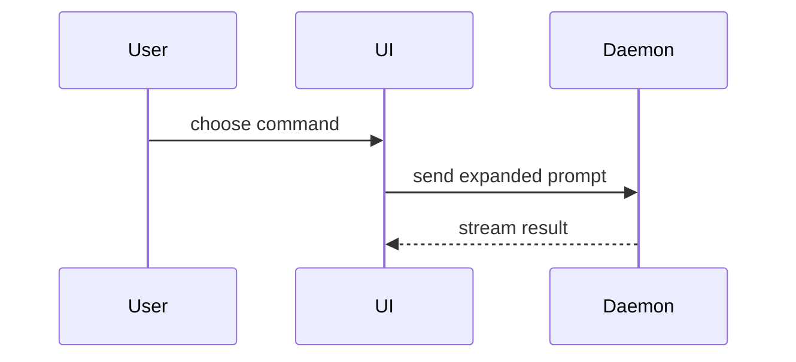

# Sequence diagram

## When to use

Show interaction, control flow, or data flow across participants over time.

## Smallest-view rule

Limit participants and messages to the current question. Prefer one happy path
unless the question is about an error branch.

## Worked example

Adapted from humanlayer's MIT `show-me` skill
([source](https://github.com/humanlayer/skills/blob/main/plugins/show-me/skills/show-me/SKILL.md)):

## File locations

Name the implementing file beside a participant or in the prose next to the
diagram (e.g. `Daemon — daemon/server.ts`). Read those files before sketching.
Not graph-backed.
